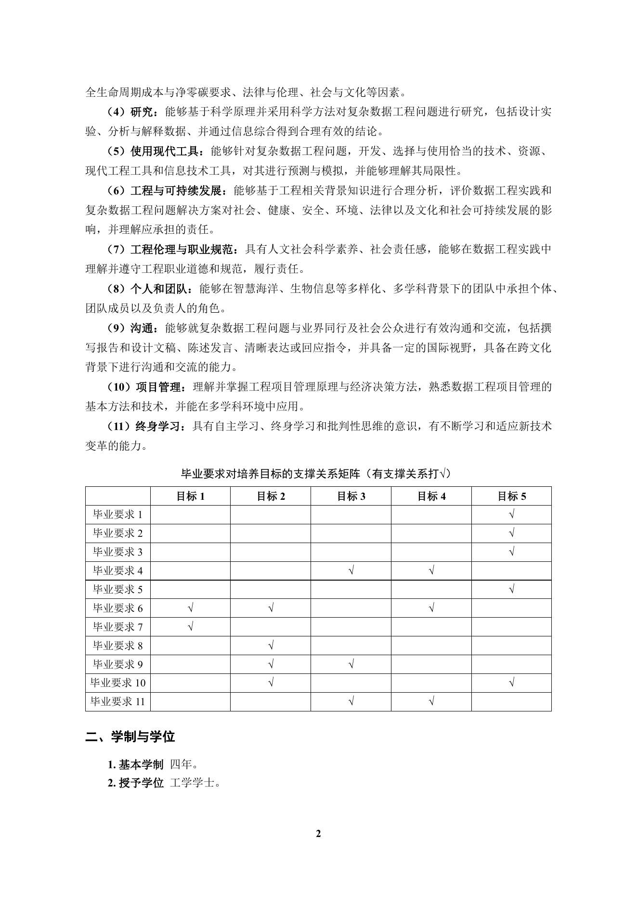

# 图 A（Markdown 版）：培养方案第 2 页“毕业要求支撑矩阵”对比

本页保留真实结果，仅将展示形式改为 Markdown，以便在支持数学公式与 HTML 表格的 Markdown 预览器中直接渲染。

## 原始 PDF 页面局部



小结：原页中的矩阵结构完整，是判断后续解析结果是否保留行列关系的参照基准。

## pdftotext -layout

```text
毕业要求对培养目标的支撑关系矩阵（有支撑关系打√）
          目标 1    目标 2       目标 3   目标 4   目标 5
毕业要求 1                                      √
毕业要求 2                                      √
毕业要求 3                                      √
毕业要求 4                        √      √
毕业要求 5                                      √
毕业要求 6     √       √                 √
毕业要求 7     √
毕业要求 8             √
毕业要求 9             √          √
毕业要求 10            √                        √
毕业要求 11                       √      √
```

小结：矩阵已线性化，虽然字符仍在，但“毕业要求-培养目标”的对应关系退化为普通文本顺序。

## MinerU pipeline

### 毕业要求对培养目标的支撑关系矩阵（MinerU pipeline）

<table><tr><td rowspan=1 colspan=1></td><td rowspan=1 colspan=1>目标1</td><td rowspan=1 colspan=1>目标2</td><td rowspan=1 colspan=1>目标3</td><td rowspan=1 colspan=1>目标4</td><td rowspan=1 colspan=1>目标5</td></tr><tr><td rowspan=1 colspan=1>毕业要求1</td><td rowspan=1 colspan=1></td><td rowspan=1 colspan=1></td><td rowspan=1 colspan=1></td><td rowspan=1 colspan=1></td><td rowspan=1 colspan=1> $\surd$ </td></tr><tr><td rowspan=1 colspan=1>毕业要求2</td><td rowspan=1 colspan=1></td><td rowspan=1 colspan=1></td><td rowspan=1 colspan=1></td><td rowspan=1 colspan=1></td><td rowspan=1 colspan=1> $\surd$ </td></tr><tr><td rowspan=1 colspan=1>毕业要求3</td><td rowspan=1 colspan=1></td><td rowspan=1 colspan=1></td><td rowspan=1 colspan=1></td><td rowspan=1 colspan=1></td><td rowspan=1 colspan=1>专</td></tr><tr><td rowspan=1 colspan=1>毕业要求4</td><td rowspan=1 colspan=1></td><td rowspan=1 colspan=1></td><td rowspan=1 colspan=1>√</td><td rowspan=1 colspan=1>√</td><td rowspan=1 colspan=1></td></tr><tr><td rowspan=1 colspan=1>毕业要求5</td><td rowspan=1 colspan=1></td><td rowspan=1 colspan=1></td><td rowspan=1 colspan=1></td><td rowspan=1 colspan=1></td><td rowspan=1 colspan=1>√</td></tr><tr><td rowspan=1 colspan=1>毕业要求6</td><td rowspan=1 colspan=1>√</td><td rowspan=1 colspan=1>√</td><td rowspan=1 colspan=1></td><td rowspan=1 colspan=1>~</td><td rowspan=1 colspan=1></td></tr><tr><td rowspan=1 colspan=1>毕业要求7</td><td rowspan=1 colspan=1>√</td><td rowspan=1 colspan=1></td><td rowspan=1 colspan=1></td><td rowspan=1 colspan=1></td><td rowspan=1 colspan=1></td></tr><tr><td rowspan=1 colspan=1>毕业要求8</td><td rowspan=1 colspan=1></td><td rowspan=1 colspan=1>√</td><td rowspan=1 colspan=1></td><td rowspan=1 colspan=1></td><td rowspan=1 colspan=1></td></tr><tr><td rowspan=1 colspan=1>毕业要求9</td><td rowspan=1 colspan=1></td><td rowspan=1 colspan=1>专</td><td rowspan=1 colspan=1>√</td><td rowspan=1 colspan=1></td><td rowspan=1 colspan=1></td></tr><tr><td rowspan=1 colspan=1>毕业要求10</td><td rowspan=1 colspan=1></td><td rowspan=1 colspan=1> $\surd$ </td><td rowspan=1 colspan=1></td><td rowspan=1 colspan=1></td><td rowspan=1 colspan=1> $\surd$ </td></tr><tr><td rowspan=1 colspan=1>毕业要求11</td><td rowspan=1 colspan=1></td><td rowspan=1 colspan=1></td><td rowspan=1 colspan=1>√</td><td rowspan=1 colspan=1> $\surd$ </td><td rowspan=1 colspan=1></td></tr></table>


小结：已恢复表格外形，但局部勾选符号存在误识别，例如“专”“~”等异常字符。

## MinerU2.5

### 毕业要求对培养目标的支撑关系矩阵（MinerU2.5）

<table><tr><td></td><td>目标1</td><td>目标2</td><td>目标3</td><td>目标4</td><td>目标5</td></tr><tr><td>毕业要求1</td><td></td><td></td><td></td><td></td><td>✓</td></tr><tr><td>毕业要求2</td><td></td><td></td><td></td><td></td><td>✓</td></tr><tr><td>毕业要求3</td><td></td><td></td><td></td><td></td><td>✓</td></tr><tr><td>毕业要求4</td><td></td><td></td><td>✓</td><td>✓</td><td></td></tr><tr><td>毕业要求5</td><td></td><td></td><td></td><td></td><td>✓</td></tr><tr><td>毕业要求6</td><td>✓</td><td>✓</td><td></td><td>✓</td><td></td></tr><tr><td>毕业要求7</td><td>✓</td><td></td><td></td><td></td><td></td></tr><tr><td>毕业要求8</td><td></td><td>✓</td><td></td><td></td><td></td></tr><tr><td>毕业要求9</td><td></td><td>✓</td><td>✓</td><td></td><td></td></tr><tr><td>毕业要求10</td><td></td><td>✓</td><td></td><td></td><td>✓</td></tr><tr><td>毕业要求11</td><td></td><td></td><td>✓</td><td>✓</td><td></td></tr></table>


小结：表格结构和勾选符号保持较完整，更适合作为后续表格块切分与元数据绑定的输入。
