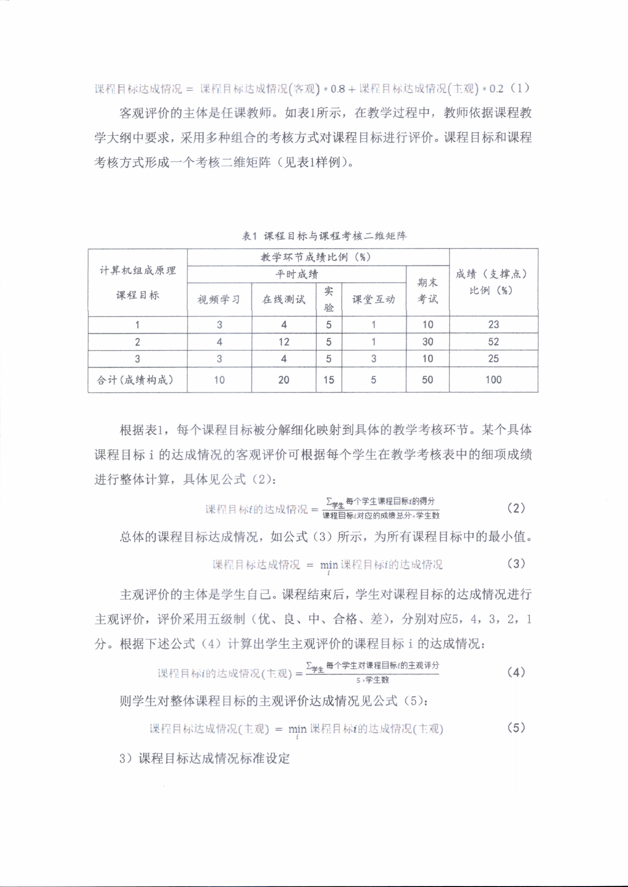

# 图 B（Markdown 版）：制度办法复杂页面对比

本页分为两部分：第一部分展示第 1 页的扫描型标题条款页，第二部分展示第 4 页的公式与表格混排页。

## 第一部分：制度办法第 1 页，标题条款页

### 原始 PDF 页面

小结：原页可见页眉、公文号、主标题与条款标题，层次关系明确。

### pdftotext -layout

**缺失：`pdftotext -layout` 第 1 页真实输出为空。**

小结：简单文本抽取在该扫描页上未获得可用结果。

### MinerU2.5

上海海洋大学信息学院课程质量评价办法

课程质量评价是教学过程质量监控的核心内容，实质是评价课程目标的达成情况，而课程目标达成评价又是毕业要求达成评价的重要依据。为确保课程质量评价工作的规范化、制度化，增强课程质量评价工作的客观性、科学性和可操作性，特制定本办法。

一、评价对象及周期
1.评价对象：各本科专业人才培养方案中开出的所有理论课程、实践课程、毕业设计。
2.评价周期：每学期开展一次。

二、评价机构

评价机构：专业达成评价工作组

三、评价依据

专业培养方案和课程教学大纲。

四、评价内容

1）理论课程教学

① 理论课程教学评价

小结：标题、条款顺序与正文边界基本保持，适合按章节边界组织语义块。

## 第二部分：制度办法第 4 页，公式与表格混排页

### 原始 PDF 页面

小结：原页同时出现矩阵表格与课程目标达成公式，是典型复杂结构页面。

### MinerU pipeline

### 表 1 课程目标与课程考核二维矩阵（MinerU pipeline）

<table><tr><td rowspan=3 colspan=1>计算机组成原理课程目标</td><td rowspan=1 colspan=5>教学环节成绩比例（%）</td><td rowspan=3 colspan=1>成绩(支撑点)比例(%)</td></tr><tr><td rowspan=1 colspan=4>平时成绩</td><td rowspan=2 colspan=1>期末考试</td></tr><tr><td rowspan=1 colspan=1>视频学习</td><td rowspan=1 colspan=1>在线测试</td><td rowspan=1 colspan=1>实验</td><td rowspan=1 colspan=1>课堂互动</td></tr><tr><td rowspan=1 colspan=1>1</td><td rowspan=1 colspan=1>3</td><td rowspan=1 colspan=1>4</td><td rowspan=1 colspan=1>5</td><td rowspan=1 colspan=1>1</td><td rowspan=1 colspan=1>10</td><td rowspan=1 colspan=1>23</td></tr><tr><td rowspan=1 colspan=1>2</td><td rowspan=1 colspan=1>4</td><td rowspan=1 colspan=1>12</td><td rowspan=1 colspan=1>5</td><td rowspan=1 colspan=1>1</td><td rowspan=1 colspan=1>30</td><td rowspan=1 colspan=1>52</td></tr><tr><td rowspan=1 colspan=1>3</td><td rowspan=1 colspan=1>3</td><td rowspan=1 colspan=1>4</td><td rowspan=1 colspan=1>5</td><td rowspan=1 colspan=1>3</td><td rowspan=1 colspan=1>10</td><td rowspan=1 colspan=1>25</td></tr><tr><td rowspan=1 colspan=1>合计(成绩构成)</td><td rowspan=1 colspan=1>10</td><td rowspan=1 colspan=1>20</td><td rowspan=1 colspan=1>15</td><td rowspan=1 colspan=1>5</td><td rowspan=1 colspan=1>50</td><td rowspan=1 colspan=1>100</td></tr></table>

以下公式片段保留为原始 LaTeX 文本，以体现 pipeline 输出的失真特征：

$$
\begin{array} { r }  \downarrow \downarrow \downarrow \downarrow \dot { \mathcal { H } } \dot { \mathcal { F } } \dot { \Xi } \equiv \dot { \mathcal { W } } \dot { \Xi } \dot { \mathcal { H } } \dot { \Xi } \dot { \mathcal { H } } \dot { \Xi } \dot { \mathcal { H } } \dot { \Xi } \dot { \mathcal { H } } \dot { \Xi } \dot { \mathcal { H } } \dot { \Xi } \dot { \mathcal { H } } \dot { \Xi } \dot { \mathcal { H } } \dot { \Xi } \dot { \mathcal { H } } \dot { \Xi } \dot { \mathcal { H } } \dot { \Xi } \dot { \mathcal { H } } \dot { \Xi } \dot { \mathcal { H } } \dot { \Xi } \dot { \mathcal { H } } \dot { \Xi } \dot { \mathcal { H } } \dot { \Xi } \dot { \mathcal { H } } \dot { \Xi } \dot { \mathcal { H } } \dot { \Xi } \dot { \mathcal { H } } \dot { \Xi } \dot { \mathcal { H } } \dot { \Xi } \dot { \mathcal { H } } \dot { \Xi } \dot { \mathcal { H } } \dot { \Xi } \dot { \Xi } \dot { \mathcal { H } } \dot { \Xi } \dot { \Xi } \dot { \mathcal { H } } \dot { \Xi } \dot { \Xi } \dot { \Xi } \dot { \Xi } \dot { \Xi } \dot { \Xi } \dot { \Xi } \dot { \Xi } \dot { \Xi } \dot { \Xi } \dot { \Xi } \dot { \Xi } \dot { \Xi } \dot { \Xi } \dot { \Xi } \dot { \Xi } \dot { \Xi } \dot { \Xi } \dot { \Xi } \dot { \Xi } \dot { \Xi } \dot { \Xi } \dot { \Xi } \dot { \Xi } \dot { \Xi } \dot { \Xi } \dot { \Xi } \dot { \Xi } \dot { \Xi } \dot { \Xi } \dot { \Xi } \dot { \Xi } \dot { \Xi } \dot { \Xi } \dot { \Xi } \dot { \Xi } \dot { \Xi } \dot { \Xi } \dot { \Xi } \dot { \Xi } \dot { \Xi } \dot { \Xi } \dot { \Xi } \dot { \Xi } \dot { \Xi } \dot { \Xi } \dot { \Xi } \dot { \Xi } \dot { \Xi } \dot { \Xi } \dot { \Xi } \dot { \Xi } \dot  \end{array}\tag{2}
$$

$$
\Zeta _ { \mathrm { R } } ^ { \prime } \boxed { \pm \sqrt { 2 } } \ z b \dot { z } \dot { z } \boxed { \sqrt { 2 } } \ z \ m \dot { z } \dot { \sqrt { 2 } } \ z \ = \ \operatorname* { m i n } _ { i } \ Z h _ { \mathrm { R } } ^ { \prime } \boxed { \pm \sqrt { 2 } } \ \boxed { \pm \sqrt { 2 } } \ z h _ { \mathrm { R } } ^ { \prime } \boxed { \sqrt { 2 } } \ z \ a \dot { \chi } \boxed { \pm \sqrt { 2 } } \ \Omega\tag{3}
$$

小结：表格主体可恢复，但公式内容明显失真，难以直接作为可用证据块。

### MinerU2.5

### 表 1 课程目标与课程考核二维矩阵（MinerU2.5）

<table><tr><td rowspan="3">计算机组成原理
课程目标</td><td colspan="5">教学环节成绩比例（%）</td><td rowspan="3">成绩（支撑点）
比例（%）</td></tr><tr><td colspan="4">平时成绩</td><td rowspan="2">期末考试</td></tr><tr><td>视频学习</td><td>在线测试</td><td>实验</td><td>课堂互动</td></tr><tr><td>1</td><td>3</td><td>4</td><td>5</td><td>1</td><td>10</td><td>23</td></tr><tr><td>2</td><td>4</td><td>12</td><td>5</td><td>1</td><td>30</td><td>52</td></tr><tr><td>3</td><td>3</td><td>4</td><td>5</td><td>3</td><td>10</td><td>25</td></tr><tr><td>合计（成绩构成）</td><td>10</td><td>20</td><td>15</td><td>5</td><td>50</td><td>100</td></tr></table>

以下公式片段直接保留为数学块，便于 Markdown 预览器渲染：

$$
\text {课 程 目 标} i \text {的 达 成 情 况} = \frac {\sum_ {\text {学 生}} \text {每 个 学 生 课 程 目 标} i \text {的 得 分}}{\text {课 程 目 标} i \text {对 应 的 成 绩 总 分} * \text {学 生 数}} \tag {2}
$$

$$
\text {课 程 目 标 达 成 情 况} = \min  _ {i} \text {课 程 目 标} i \text {的 达 成 情 况} \tag {3}
$$

小结：表格结构、公式编号与公式语义整体保持较好，更适合作为后续精细化切块的输入。
