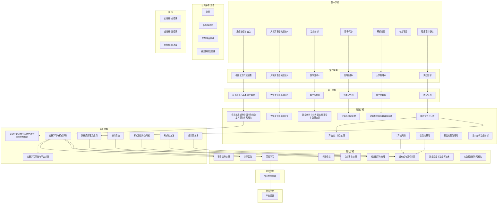

# 数据科学与大数据技术专业 2023 级本科人才培养方案

## 一、专业基本信息

- **学 院**: 人工智能与数据科学学院
- **学科门类**: 工学
- **专业类别**: 计算机类
- **专业名称**: 数据科学与大数据技术
- **学 制**: 四年
- **授予学位**: 工学学士

## 二、专业培养目标

本专业秉承“勤慎公忠”的校训和“工学并举”的办学特色，面向京津冀协调发展建设的大数据挖掘、智能数字化、人工智能等领域的产业需求，以素质教育、创新教育为核心，以理学基础和工学应用联合培养为特色，培养适应社会主义现代化建设和未来社会和科技发展需要、德智体美劳全面发展，严谨务实、开拓创新、具有高度社会责任感，能够从事数据科学理论研究、大数据系统设计、开发、管理等工作的复合型高素质理、工结合型技术人才。

学生毕业五年后应具备以下能力。

（1）具有良好的社会责任感、职业道德和人文科学素养，具备工程伦理道德责任和尊重社会价值的能力。

（2）适应现代计算机发展需要和社会经济需求，融汇贯通数学与自然科学知识以及大数据专业理论、技能，独立分析工作中遇到的问题，对复杂科学问题、工程原理研究提出系统性解决方案。

（3）具有较强的科学洞察力，能够跟踪大数据相关领域的前沿技术，具备工程创新能

力，在本领域的工程设计、技术开发等工作中发挥骨干作用。

（4）具有良好的全球化意识和国际视野，能够主动适应国内外形势及环境变化，拥有较强的自学能力、创新能力和持续发展能力。

（5）具备良好的沟通协作、组织领导以及项目管理能力。

# 三、专业毕业要求及实现矩阵

## (一) 毕业要求

### 1、毕业要求

**（1）工程知识：** 具有数据科学与大数据技术专业所需的数学、自然科学、工程基础和专业知识，并综合运用所学知识解决数据科学与大数据技术及人工智能领域中的复杂工程问题。

**（2）问题分析：** 能够运用数学、自然科学和工程科学的基本原理和方法，通过文献研究，识别、表达复杂计算机工程问题，以获得有效结论。

**（3）设计/开发解决方案：** 能够综合运用理论和技术手段，针对数据科学与大数据技术及人工智能领域复杂工程问题提出解决方案，设计满足特定需求的系统、模块或开发流程，并在设计开发过程中体现创新意识，综合考虑社会、健康、安全、法律、文化以及环境等因素。

**（4）研究：** 能够基于计算机及人工智能原理并采用科学方法对数据科学与大数据技术及人工智能领域中的复杂工程问题进行研究，制定技术路线、设计实验方案，并分析和解释数据并得到合理有效的结论。

**（5）使用现代工具：** 能够针对数据科学与大数据技术及人工智能领域中的复杂工程问题，开发、选择与使用恰当的技术、资源、现代工程工具和信息技术工具进行预测与模拟，能够在实践过程中理解相关方法及工具的局限性。

**（6）工程与社会：** 能够基于工程相关背景知识进行分析，评价数据科学与大数据技术专业及人工智能工程实践和复杂工程问题解决方案，明确对社会、健康、安全、法律以及文化的影响，并理解应承担的责任。

**（7）环境和可持续发展：** 具有环境保护和可持续发展意识，能够理解和评价复杂工程问题的工程实践对环境和社会可持续发展的影响。

**（8）职业规范：** 具有人文社会科学素养和社会责任感，能够在大数据系统设计开发等工程实践中理解并遵守工程职业道德和行为规范，履行大数据工程师的社会责任。

**（9）个人和团队：** 具有较强的团队合作意识与能力，能够正确理解多学科背景下的团队中个体、团队成员以及负责人的角色，并承担其责任与义务。

**（10）沟通：** 能够就数据科学与大数据技术、人工智能领域的复杂工程问题与同行及社会公众进行有效地沟通和交流；能够理解和撰写报告和设计文稿，进行陈述发言、清晰表达和答辩；熟练掌握一门外语，能够阅读数据科学与大数据技术及人工智能相关的外文资料，具有一定的国际视野，能进行跨文化沟通和交流。

**（11）项目管理：** 理解并掌握工程管理原理与经济决策方法，并能在多学科环境中应用。

**（12）终身学习：** 具有自主学习和终身学习的意识，能够追踪数据科学与大数据技术及人工智能领域的发展动态，有不断学习和适应发展的能力。

## 2、毕业要求对培养目标的支撑

本专业 12 条毕业要求是对学生毕业时获得的数学知识、自然科学知识、人文科学素养、工程知识、专业知识以及针对数据科学与大数据技术领域分析问题、解决问题、团队合作等能力的综合要求，其能够完全支撑专业培养目标的实现，毕业要求对培养目标的支撑关系如表 1 所示。

表 1 本专业毕业要求培养目标的支撑关系矩阵

<table>
  <thead>
    <tr>
        <th></th>
        <th>目标 1</th>
        <th>目标 2</th>
        <th>目标 3</th>
        <th>目标 4</th>
        <th>目标 5</th>
    </tr>
  </thead>
  <tbody>
    <tr>
        <td>毕业要求 1：工程知识</td>
        <td></td>
        <td></td>
        <td>√</td>
        <td></td>
        <td></td>
    </tr>
    <tr>
        <td>毕业要求 2：问题分析</td>
        <td></td>
        <td>√</td>
        <td></td>
        <td></td>
        <td></td>
    </tr>
    <tr>
        <td>毕业要求 3：设计/开发解决方案</td>
        <td></td>
        <td></td>
        <td>√</td>
        <td></td>
        <td></td>
    </tr>
    <tr>
        <td>毕业要求 4：研究</td>
        <td></td>
        <td>√</td>
        <td></td>
        <td></td>
        <td></td>
    </tr>
    <tr>
        <td>毕业要求 5：使用现代工具</td>
        <td></td>
        <td>√</td>
        <td>√</td>
        <td></td>
        <td></td>
    </tr>
    <tr>
        <td>毕业要求 6：工程与社会</td>
        <td>√</td>
        <td></td>
        <td></td>
        <td></td>
        <td></td>
    </tr>
    <tr>
        <td>毕业要求 7：环境和可持续发展</td>
        <td>√</td>
        <td></td>
        <td></td>
        <td></td>
        <td></td>
    </tr>
    <tr>
        <td>毕业要求 8：职业规范</td>
        <td>√</td>
        <td></td>
        <td></td>
        <td></td>
        <td></td>
    </tr>
    <tr>
        <td>毕业要求 9：个人和团队</td>
        <td></td>
        <td></td>
        <td></td>
        <td></td>
        <td>√</td>
    </tr>
    <tr>
        <td>毕业要求 10：沟通</td>
        <td></td>
        <td></td>
        <td></td>
        <td></td>
        <td>√</td>
    </tr>
    <tr>
        <td>毕业要求 11：项目管理</td>
        <td></td>
        <td></td>
        <td></td>
        <td></td>
        <td>√</td>
    </tr>
    <tr>
        <td>毕业要求 12：终身学习</td>
        <td></td>
        <td></td>
        <td></td>
        <td>√</td>
        <td></td>
    </tr>
  </tbody>
</table>

## 3、毕业要求分解

根据中国工程教育认证的通用标准和计算机类专业补充标准，专业制定了全部覆盖通用标准的本专业 12 条毕业要求，并根据其内涵将毕业要求细化为具有可衡量性、逻辑性、导向性和专业特点的指标点，通过指标点的分解，一方面引导教师有针对性地教学，使得教学效果可检测、可考核、可评价，一方面引导学生有目的的学习，让学生在作业、试卷、报告、论文等学习成果中可表达。可以安排教学内容并可衡量其效果的具体二级指标点如表 2 所示。

表 2 毕业要求指标分解表

<table>
  <thead>
    <tr>
        <th>毕业要求</th>
        <th>指标点</th>
    </tr>
  </thead>
  <tbody>
    <tr>
        <td>**毕业要求 1-工程知识** 具有数据科学与大数据技术专业所需的数学、自然科学、工程基础和专业知识，并综合运用所学知识解决数据科学与大数据技术及人工智能领域中的复杂工程问题。</td>
        <td>1-1. 掌握数学和自然科学相关知识、理论，具有数学分析和运算能力。 1-2. 掌握工程基础知识，并能够在大数据系统设计开发中以工程理念及方法解决实际问题。 1-3. 掌握数据科学与及人工智能专业知识，并能够综合应用相关知识解决计算机软硬件设计与应用开发中的复杂工程问题。</td>
    </tr>
    <tr>
        <td>**毕业要求 2-问题分析** 能够运用数学、自然科学和工程科学的基本原理和方法，通过文献研究，识别、表达复杂数据科学与大数据技术工程问题，以获得有效结</td>
        <td>2-1. 能够基于数学、自然科学和工程科学的基本原理，对复杂工程问题进行需求分析、模型构建、参数设置和问题表达。 2-2. 能够根据问题情境，结合文献研究，对大数据系统设计与应用开发中的复杂工程问题进行识别。 2-3. 能够综合运用工程原理、工程方法和文献研究，对复杂工程</td>
    </tr>
  </tbody>
</table>

<table>
  <thead>
    <tr>
        <th>毕业要求</th>
        <th>指标点</th>
    </tr>
  </thead>
  <tbody>
    <tr>
        <td>论。</td>
        <td>问题解决方案进行分析和验证，并形成有效结论。</td>
    </tr>
    <tr>
        <td>**毕业要求 3-设计/开发解决方案** 能够综合运用理论和技术手段，针对数据科学与大数据技术及人工智能领域复杂工程问题提出解决方案，设计满足特定需求的系统、模块或开发流程，并在设计开发过程中体现创新意识，综合考虑社会、健康、安全、法律、文化以及环境等因素。</td>
        <td>3-1 了解并掌握数据科学与大数据技术及人工智能应用系统开发的流程和技术标准，能够综合运用理论和技术手段对数据科学与大数据技术及人工智能领域的复杂工程问题提出解决方案。 3-2 能够对提出的解决方案进行分析、评价和优选，设计满足需求的系统、模块或开发流程，并体现创新意识。 3-3 针对复杂工程问题，能够从系统的角度权衡所涉及的相关因素，考虑社会、健康、安全、法律、文化以及环境等因素的影响。</td>
    </tr>
    <tr>
        <td>**毕业要求 4-研究** 能够基于计算机及人工智能原理并采用科学方法对数据科学与大数据技术及人工智能领域中的复杂工程问题进行研究，制定技术路线、设计实验方案，并分析和解释数据并得到合理有效的结论。</td>
        <td>4-1. 能够针对复杂工程问题利用理论分析等手段，给出相关问题的研究目标和设计思路。 4-2. 能够基于科学原理并采用科学方法对数据科学与大数据技术及人工智能系统设计与应用开发制定合理的技术路线，设计可行的实验方案。 4-3. 能够选择并搭建实验平台，选用科学的方法进行实验并解决实验中出现的问题，对实验数据和实验结果进行分析解释，并通过信息综合得到合理有效的结论。</td>
    </tr>
    <tr>
        <td>**毕业要求 5-使用现代工具** 能够针对数据科学与大数据技术及人工智能领域中的复杂工程问题，开发、选择与使用恰当的技术、资源、现代工程工具和信息技术工具进行预测与模拟，能够在实践过程中理解相关方法及工具的局限性。</td>
        <td>5-1 熟练掌握设计、仿真、开发、测试等现代工具，能够对大数据及人工智能系统设计与应用开发中的复杂工程问题进行分析、设计、仿真、预测与模拟。 5-2 能够通过图书、文献、计算机网络等途径检索、查询数据科学与大数据技术专业相关资料及文献，获得有用信息。 5-3 能够理解现代工程工具和信息技术工具对复杂工程问题设计与模拟的优势、应用场合和局限性。</td>
    </tr>
    <tr>
        <td>**毕业要求 6-工程与社会** 能够基于工程相关背景知识进行分析，评价数据科学与大数据技术专业及人工智能工程实践和复杂工程问题解决方案，明确对社会、健康、安全、法律以及文化的影响，并理解应承担的责任。</td>
        <td>6-1 具有良好的社会公德、社会责任感和计算机职业道德，具有信息安全及知识产权保护及相关法律意识。 6-2 能够评价数据科学与大数据技术及人工智能工程实践和复杂工程问题解决方案对社会、健康、安全、法律以及文化的影响，正确处理直接近期利益与间接远期后果的关系，并理解应承担的责任。</td>
    </tr>
    <tr>
        <td>**毕业要求 7-环境和可持续发展** 具有环境保护和可持续发展意识，能够理解和评价复杂工程问题的工程实践对环境和社会可持续发展的影响。</td>
        <td>7-1 具有环境保护和可持续发展意识，了解环境保护相关政策法规。 7-2 能够合理评价复杂工程问题的工程实践和解决方案对环境和可持续发展的影响。</td>
    </tr>
    <tr>
        <td>**毕业要求 8-职业规范** 具有人文社会科学素养和社会责任感，能够在大数据系统设计与应用开发等工程实践中理解并遵守工程职业道德和行为规范，履行计算机工程师的社会责任。</td>
        <td>8-1 具有人文社会科学素养、正确的人生观、价值观和世界观，维护国家利益，具有推动民族复兴和社会进步的责任感。 8-2 能够在数据科学与大数据技术及人工智能系统设计与应用开发等工程实践中理解并遵守工程职业道德和行为规范，履行工程师的社会责任。</td>
    </tr>
    <tr>
        <td>**毕业要求 9-个人和团队** 具有较强的团队合作意识与能力，能够正确理解多学科背景下的团队</td>
        <td>9-1. 有较强的团队合作意识与能力，能与其他成员共享信息、协调合作，正确处理个人和团队关系。 9-2. 正确理解多学科背景下的团队中个体、团队成员以及负责人</td>
    </tr>
  </tbody>
</table>

<table>
  <thead>
    <tr>
        <th>毕业要求</th>
        <th>指标点</th>
    </tr>
  </thead>
  <tbody>
    <tr>
        <td>中个体、团队成员以及负责人的角色，并承担其责任与义务。</td>
        <td>的角色，并按照需求承担相应任务。</td>
    </tr>
    <tr>
        <td>**毕业要求 10-沟通** 能够就数据科学与大数据技术、人工智能领域的复杂工程问题与同行及社会公众进行有效地沟通和交流；能够理解和撰写报告和设计文稿，进行陈述发言、清晰表达和答辩；熟练掌握一门外语，能够阅读数据科学与大数据技术及人工智能相关的外文资料，具有一定的国际视野，能进行跨文化沟通和交流。</td>
        <td>10-1. 具有良好的书面及口头表达能力，能够熟练运用工程技术语言针对复杂工程问题进行描述、表达与答辩，并能够与同行及社会公众进行有效地沟通和交流。 10-2. 了解大数据系统工程及相关专业科技文档的基本构成及要求，并能按要求撰写报告与设计文档。 10-3 具备较强的外语听说读写能力，能够阅读数据科学与大数据技术相关的外文资料，具有一定的国际视野，能进行跨文化沟通和交流。</td>
    </tr>
    <tr>
        <td>**毕业要求 11-项目管理** 理解并掌握工程管理原理与经济决策方法，并能在多学科环境中应用。</td>
        <td>11-1. 理解并掌握工程管理原理与经济决策方法。 11-2.在多学科环境中能够将管理原理、经济决策应用于大数据系统设计、人工智能应用开发等过程。</td>
    </tr>
    <tr>
        <td>**毕业要求 12-终身学习** 具有自主学习和终身学习的意识，能够追踪数据科学与大数据技术及人工智能领域的发展动态，有不断学习和适应发展的能力。</td>
        <td>12-1.具有自主学习的意识，能够针对科学与技术问题，采用合适的方法进行学习。 12-2.具有终身学习的意识，主动追踪数据科学与大数据技术及人工智能研究领域的发展动态，不断学习和适应持续发展的要求。</td>
    </tr>
  </tbody>
</table>

## (二)实现矩阵

<table>
  <thead>
    <tr>
        <th>毕业要求</th>
        <th>实现环节或途径</th>
    </tr>
  </thead>
  <tbody>
    <tr>
        <td>1.工程知识</td>
        <td>通过数学分析、高等代数等多门数学专业课程掌握数据分析背后的数理原理知识；通过数据结构、计算智能等课程掌握基础性计算机编程知识；通过计算机组成原理、计算机网络等课程掌握计算机硬件原理知识；通过机器学习与模式识别、数据统计与分析基础、数据挖掘与数据仓库等一系列课程掌握前沿大数据分析工程知识。</td>
    </tr>
    <tr>
        <td>2.问题分析</td>
        <td>通过离散数学、数据库原理及应用等课程实现任务原理性思考分析，通过程序综合实验、计算机组成原理课程设计、专业方向实训、系统设计与开发、算法设计综合实践、软件设计与编程实践、数据分析系统与平台实践、毕业设计等课程实现一系列实际问题的分析和解决。</td>
    </tr>
    <tr>
        <td>3.设计/开发解决方案</td>
        <td>通过数据结构、计算机组成原理、计算机网络、操作系统、数据库原理及应用等课程掌握解决方案的设计原理，通过系统设计与开发、软件设计与编程实践、数据分析系统与平台实践、毕业设计实现解决方案的开发。</td>
    </tr>
    <tr>
        <td>4.研究</td>
        <td>整合工程知识学习与掌握，实际问题的原理分析和解决方案的设计与开发，形成对前沿专业问题的研究，在机器学习与模式识别、数据统计与分析基础、大数据分析与可视化、数据挖掘与数据仓库、深度学习、机器视觉、自然语言处理、计算智能、云计算技术、软件设计与编程实践、数据分析系统与平台实践等课程中均涉及对前沿问题的原理理解和解决方案推理，最终形成对前沿问题的研究。</td>
    </tr>
    <tr>
        <td>5.使用现代工具</td>
        <td>在程序综合实验、计算机网络、操作系统实验、专业方向实训、毕业设计、系统设计与开发、软件设计与编程实践、数据分析系统与平台实践等一系列课程中，均依赖于现代数据编程、数据分析工具。</td>
    </tr>
    <tr>
        <td>6.工程与社会</td>
        <td>通过思想道德与法治、毛泽东思想与中国特色社会主义理论体系概论、马克思主义基本原理、当代工程观与科技创新、习近平总书记关于科技创新的重要论</td>
    </tr>
  </tbody>
</table>

<table>
  <tbody>
    <tr>
        <td>毕业要求</td>
        <td>实现环节或途径</td>
    </tr>
    <tr>
        <th></th>
        <th>述课程理解工程与社会的基本原理，并在软件设计与编程实践、数据分析系统与平台实践、工程认知训练、毕业设计等课程中形成实际应用</th>
    </tr>
    <tr>
        <td>7.环境和可持续发展</td>
        <td>在思想道德与法治、毛泽东思想与中国特色社会主义理论体系概论、形势政策、生态环境与幸福生活类、当代工程观与科技创新、习近平总书记关于科技创新的重要论述、专业导论、毕业设计等一系列课程中形成对环境和可持续发展的政策理解、学习及应用。</td>
    </tr>
    <tr>
        <td>8.职业规范</td>
        <td>在思想道德与法治、中国近现代史纲要、毛泽东思想与中国特色社会主义理论体系概论、马克思主义基本原理、心理健康教育、大学生职业发展与就业指导、工程认知训练、习近平总书记关于科技创新的重要论述、专业导论等专业课程中，形成学生对于职业规范的认知和认同，通过潜移默化的方式塑造学生的职业规范。</td>
    </tr>
    <tr>
        <td>9.个人和团队</td>
        <td>在体育、软件设计与编程实践、数据分析系统与平台实践、项目管理等课程中，均包含了个人作业模块和团队写作模块，学生需同时完成个人和团队两层级的学习作业，形成对学生能力的塑造。</td>
    </tr>
    <tr>
        <td>10、沟通</td>
        <td>在程序综合实验、毕业设计、计算机系统基础实验、系统设计与开发、软件设计与编程实践、数据分析系统与平台实践、工程认知训练、心理健康教育、大学英语等一系列课程中，均包含了学生之间的相互交流和合作的内容，形成对学生沟通能力的训练。另外，数据挖掘与数据仓库、大数据分析与可视化等双语课程保证了学生对国际学术前沿的了解，对前沿技术的了解和掌握，催动了学生的国际化视野。</td>
    </tr>
    <tr>
        <td>11.项目管理</td>
        <td>通过项目管理课程学习其中原理，通过针对性训练形成具体的实践和掌握。</td>
    </tr>
    <tr>
        <td>12.终身学习</td>
        <td>在专业导论、毕业设计、工程认知训练等课程中形成对专业领域的全方位了解，建立学生终身学习的习惯。</td>
    </tr>
  </tbody>
</table>

### (三)专业课程体系与毕业要求的关联矩阵表

表中教学环节：课程、实践环节、训练等；根据课程对各项毕业要求的支撑强度分别用“H(高)、M(中)、L(弱)”表示，**支撑强度**根据该课程支撑的毕业要求指标点的多寡来确定。

<table>
    <thead>
    <tr>
        <th>课程名称</th>
        <th colspan="3">1
工程知识</th>
        <th colspan="3">2
问题分析</th>
        <th colspan="3">3
设计/开发
解决方案</th>
        <th colspan="3">4
研究</th>
        <th colspan="3">5
使用现代
工具</th>
        <th colspan="2">6
工程与
社会</th>
        <th colspan="2">7
环境和
可持续
发展</th>
        <th colspan="2">8
职业
规范</th>
        <th colspan="2">9
个人和
团队</th>
        <th colspan="3">10
沟通</th>
        <th colspan="2">11
项目
管理</th>
        <th colspan="2">12
终身
学习</th>
    </tr>
    </thead>
    <tr>
        <td></td>
        <td>1</td>
        <td>2</td>
        <td>3</td>
        <td>1</td>
        <td>2</td>
        <td>3</td>
        <td>1</td>
        <td>2</td>
        <td>3</td>
        <td>1</td>
        <td>2</td>
        <td>3</td>
        <td>1</td>
        <td>2</td>
        <td>3</td>
        <td>1</td>
        <td>2</td>
        <td>1</td>
        <td>2</td>
        <td>1</td>
        <td>2</td>
        <td>1</td>
        <td>2</td>
        <td>1</td>
        <td>2</td>
        <td>3</td>
        <td>1</td>
        <td>2</td>
        <td>1</td>
        <td>2</td>
    </tr>
    <tr>
        <td>数学分析</td>
        <td>H</td>
        <td></td>
        <td></td>
        <td></td>
        <td></td>
        <td></td>
        <td></td>
        <td></td>
        <td></td>
        <td></td>
        <td></td>
        <td></td>
        <td></td>
        <td></td>
        <td></td>
        <td></td>
        <td></td>
        <td></td>
        <td></td>
        <td></td>
        <td></td>
        <td></td>
        <td></td>
        <td></td>
        <td></td>
        <td></td>
        <td></td>
        <td></td>
        <td></td>
        <td></td>
    </tr>
    <tr>
        <td>高等代数</td>
        <td>H</td>
        <td></td>
        <td></td>
        <td></td>
        <td></td>
        <td></td>
        <td></td>
        <td></td>
        <td></td>
        <td></td>
        <td></td>
        <td></td>
        <td></td>
        <td></td>
        <td></td>
        <td></td>
        <td></td>
        <td></td>
        <td></td>
        <td></td>
        <td></td>
        <td></td>
        <td></td>
        <td></td>
        <td></td>
        <td></td>
        <td></td>
        <td></td>
        <td></td>
        <td></td>
    </tr>
    <tr>
        <td>概率论与数理统计</td>
        <td>H</td>
        <td></td>
        <td></td>
        <td></td>
        <td></td>
        <td></td>
        <td></td>
        <td></td>
        <td></td>
        <td></td>
        <td></td>
        <td></td>
        <td></td>
        <td></td>
        <td></td>
        <td></td>
        <td></td>
        <td></td>
        <td></td>
        <td></td>
        <td></td>
        <td></td>
        <td></td>
        <td></td>
        <td></td>
        <td></td>
        <td></td>
        <td></td>
        <td></td>
        <td></td>
    </tr>
    <tr>
        <td>解析几何</td>
        <td>H</td>
        <td></td>
        <td></td>
        <td></td>
        <td></td>
        <td></td>
        <td></td>
        <td></td>
        <td></td>
        <td></td>
        <td></td>
        <td></td>
        <td></td>
        <td></td>
        <td></td>
        <td></td>
        <td></td>
        <td></td>
        <td></td>
        <td></td>
        <td></td>
        <td></td>
        <td></td>
        <td></td>
        <td></td>
        <td></td>
        <td></td>
        <td></td>
        <td></td>
        <td></td>
    </tr>
    <tr>
        <td>常微分方程</td>
        <td>H</td>
        <td></td>
        <td></td>
        <td></td>
        <td></td>
        <td></td>
        <td></td>
        <td></td>
        <td></td>
        <td></td>
        <td></td>
        <td></td>
        <td></td>
        <td></td>
        <td></td>
        <td></td>
        <td></td>
        <td></td>
        <td></td>
        <td></td>
        <td></td>
        <td></td>
        <td></td>
        <td></td>
        <td></td>
        <td></td>
        <td></td>
        <td></td>
        <td></td>
        <td></td>
    </tr>
    <tr>
        <td>大学物理 IA、IB</td>
        <td>H</td>
        <td></td>
        <td></td>
        <td></td>
        <td></td>
        <td></td>
        <td></td>
        <td></td>
        <td></td>
        <td></td>
        <td></td>
        <td></td>
        <td></td>
        <td></td>
        <td></td>
        <td></td>
        <td></td>
        <td></td>
        <td></td>
        <td></td>
        <td></td>
        <td></td>
        <td></td>
        <td></td>
        <td></td>
        <td></td>
        <td></td>
        <td></td>
        <td></td>
        <td></td>
    </tr>
    <tr>
        <td>大学物理实验 IA、IB</td>
        <td></td>
        <td></td>
        <td></td>
        <td></td>
        <td></td>
        <td></td>
        <td></td>
        <td></td>
        <td></td>
        <td>H</td>
        <td></td>
        <td></td>
        <td></td>
        <td></td>
        <td></td>
        <td></td>
        <td></td>
        <td></td>
        <td></td>
        <td></td>
        <td></td>
        <td></td>
        <td></td>
        <td></td>
        <td></td>
        <td></td>
        <td></td>
        <td></td>
        <td></td>
        <td></td>
    </tr>
    <tr>
        <td>思想道德与法治</td>
        <td></td>
        <td></td>
        <td></td>
        <td></td>
        <td></td>
        <td></td>
        <td></td>
        <td></td>
        <td></td>
        <td></td>
        <td></td>
        <td></td>
        <td></td>
        <td></td>
        <td></td>
        <td>H</td>
        <td></td>
        <td></td>
        <td></td>
        <td>H</td>
        <td></td>
        <td></td>
        <td></td>
        <td></td>
        <td></td>
        <td></td>
        <td></td>
        <td></td>
        <td></td>
        <td></td>
    </tr>
    <tr>
        <td>中国近现代史纲要</td>
        <td></td>
        <td></td>
        <td></td>
        <td></td>
        <td></td>
        <td></td>
        <td></td>
        <td></td>
        <td></td>
        <td></td>
        <td></td>
        <td></td>
        <td></td>
        <td></td>
        <td></td>
        <td>M</td>
        <td></td>
        <td>H</td>
        <td></td>
        <td>H</td>
        <td></td>
        <td></td>
        <td></td>
        <td></td>
        <td></td>
        <td></td>
        <td></td>
        <td></td>
        <td></td>
        <td></td>
    </tr>
    <tr>
        <td>毛泽东思想与中国特色社会主
义理论体系概论</td>
        <td></td>
        <td></td>
        <td></td>
        <td></td>
        <td></td>
        <td></td>
        <td></td>
        <td></td>
        <td></td>
        <td></td>
        <td></td>
        <td></td>
        <td></td>
        <td></td>
        <td></td>
        <td>H</td>
        <td></td>
        <td>H</td>
        <td></td>
        <td>H</td>
        <td></td>
        <td></td>
        <td></td>
        <td></td>
        <td></td>
        <td></td>
        <td></td>
        <td></td>
        <td></td>
        <td></td>
    </tr>
    <tr>
        <td>马克思主义基本原理概论</td>
        <td></td>
        <td></td>
        <td></td>
        <td></td>
        <td></td>
        <td></td>
        <td></td>
        <td></td>
        <td></td>
        <td></td>
        <td></td>
        <td></td>
        <td></td>
        <td></td>
        <td></td>
        <td>H</td>
        <td></td>
        <td></td>
        <td></td>
        <td>H</td>
        <td></td>
        <td></td>
        <td></td>
        <td></td>
        <td></td>
        <td></td>
        <td></td>
        <td></td>
        <td></td>
        <td></td>
    </tr>
    <tr>
        <td>形势与政策</td>
        <td></td>
        <td></td>
        <td></td>
        <td></td>
        <td></td>
        <td></td>
        <td></td>
        <td></td>
        <td></td>
        <td></td>
        <td></td>
        <td></td>
        <td></td>
        <td></td>
        <td></td>
        <td></td>
        <td></td>
        <td>H</td>
        <td></td>
        <td></td>
        <td></td>
        <td></td>
        <td></td>
        <td></td>
        <td></td>
        <td></td>
        <td></td>
        <td></td>
        <td></td>
        <td></td>
    </tr>
    <tr>
        <td>思想政治实践</td>
        <td></td>
        <td></td>
        <td></td>
        <td></td>
        <td></td>
        <td></td>
        <td></td>
        <td></td>
        <td></td>
        <td></td>
        <td></td>
        <td></td>
        <td></td>
        <td></td>
        <td></td>
        <td></td>
        <td></td>
        <td></td>
        <td></td>
        <td>H</td>
        <td></td>
        <td></td>
        <td></td>
        <td></td>
        <td></td>
        <td></td>
        <td></td>
        <td></td>
        <td></td>
        <td></td>
    </tr>
    <tr>
        <td>大学英语基础模块</td>
        <td></td>
        <td></td>
        <td></td>
        <td></td>
        <td></td>
        <td></td>
        <td></td>
        <td></td>
        <td></td>
        <td></td>
        <td></td>
        <td></td>
        <td></td>
        <td></td>
        <td></td>
        <td></td>
        <td></td>
        <td></td>
        <td></td>
        <td></td>
        <td></td>
        <td></td>
        <td></td>
        <td></td>
        <td></td>
        <td>H</td>
        <td></td>
        <td></td>
        <td></td>
        <td></td>
    </tr>
    <tr>
        <td>大学英语拓展模块课程</td>
        <td></td>
        <td></td>
        <td></td>
        <td></td>
        <td></td>
        <td></td>
        <td></td>
        <td></td>
        <td></td>
        <td></td>
        <td></td>
        <td></td>
        <td></td>
        <td></td>
        <td></td>
        <td></td>
        <td></td>
        <td></td>
        <td></td>
        <td></td>
        <td></td>
        <td></td>
        <td></td>
        <td></td>
        <td></td>
        <td>H</td>
        <td></td>
        <td></td>
        <td></td>
        <td></td>
    </tr>
    <tr>
        <td>体育</td>
        <td></td>
        <td></td>
        <td></td>
        <td></td>
        <td></td>
        <td></td>
        <td></td>
        <td></td>
        <td></td>
        <td></td>
        <td></td>
        <td></td>
        <td></td>
        <td></td>
        <td></td>
        <td></td>
        <td></td>
        <td></td>
        <td></td>
        <td></td>
        <td></td>
        <td>H</td>
        <td></td>
        <td></td>
        <td></td>
        <td></td>
        <td></td>
        <td></td>
        <td></td>
        <td></td>
    </tr>
    <tr>
        <td>心理健康教育</td>
        <td></td>
        <td></td>
        <td></td>
        <td></td>
        <td></td>
        <td></td>
        <td></td>
        <td></td>
        <td></td>
        <td></td>
        <td></td>
        <td></td>
        <td></td>
        <td></td>
        <td></td>
        <td></td>
        <td>H</td>
        <td></td>
        <td></td>
        <td></td>
        <td></td>
        <td></td>
        <td></td>
        <td></td>
        <td></td>
        <td></td>
        <td></td>
        <td></td>
        <td></td>
        <td></td>
    </tr>
    <tr>
        <td>大学生职业发展与就业指导</td>
        <td></td>
        <td></td>
        <td></td>
        <td></td>
        <td></td>
        <td></td>
        <td></td>
        <td></td>
        <td></td>
        <td></td>
        <td></td>
        <td></td>
        <td></td>
        <td></td>
        <td></td>
        <td></td>
        <td>M</td>
        <td></td>
        <td></td>
        <td>H</td>
        <td></td>
        <td></td>
        <td></td>
        <td></td>
        <td></td>
        <td></td>
        <td></td>
        <td></td>
        <td></td>
        <td></td>
    </tr>
    <tr>
        <td>创业基础</td>
        <td></td>
        <td></td>
        <td></td>
        <td></td>
        <td></td>
        <td></td>
        <td></td>
        <td></td>
        <td></td>
        <td></td>
        <td></td>
        <td></td>
        <td></td>
        <td></td>
        <td></td>
        <td>M</td>
        <td></td>
        <td></td>
        <td></td>
        <td>M</td>
        <td></td>
        <td></td>
        <td></td>
        <td></td>
        <td></td>
        <td></td>
        <td></td>
        <td></td>
        <td></td>
        <td></td>
    </tr>
    <tr>
        <td>文史经典与文化传承类</td>
        <td></td>
        <td></td>
        <td></td>
        <td></td>
        <td></td>
        <td></td>
        <td></td>
        <td></td>
        <td></td>
        <td></td>
        <td></td>
        <td></td>
        <td></td>
        <td></td>
        <td></td>
        <td>M</td>
        <td></td>
        <td></td>
        <td></td>
        <td>M</td>
        <td></td>
        <td></td>
        <td></td>
        <td></td>
        <td></td>
        <td></td>
        <td></td>
        <td></td>
        <td></td>
        <td></td>
    </tr>
    <tr>
        <td>哲学智慧与批判思维类</td>
        <td></td>
        <td></td>
        <td></td>
        <td></td>
        <td></td>
        <td></td>
        <td></td>
        <td></td>
        <td></td>
        <td></td>
        <td></td>
        <td></td>
        <td></td>
        <td></td>
        <td></td>
        <td></td>
        <td></td>
        <td></td>
        <td></td>
        <td>M</td>
        <td></td>
        <td></td>
        <td></td>
        <td></td>
        <td></td>
        <td></td>
        <td></td>
        <td></td>
        <td></td>
        <td></td>
    </tr>
    <tr>
        <td>文明发展与国际视野类</td>
        <td></td>
        <td></td>
        <td></td>
        <td></td>
        <td></td>
        <td></td>
        <td></td>
        <td></td>
        <td></td>
        <td></td>
        <td></td>
        <td></td>
        <td></td>
        <td></td>
        <td></td>
        <td></td>
        <td></td>
        <td></td>
        <td></td>
        <td></td>
        <td></td>
        <td></td>
        <td></td>
        <td></td>
        <td></td>
        <td>M</td>
        <td></td>
        <td></td>
        <td></td>
        <td></td>
    </tr>
    <tr>
        <td>社会进步与当代中国类</td>
        <td></td>
        <td></td>
        <td></td>
        <td></td>
        <td></td>
        <td></td>
        <td></td>
        <td></td>
        <td></td>
        <td></td>
        <td></td>
        <td></td>
        <td></td>
        <td></td>
        <td></td>
        <td>M</td>
        <td></td>
        <td></td>
        <td></td>
        <td></td>
        <td></td>
        <td></td>
        <td></td>
        <td></td>
        <td></td>
        <td></td>
        <td></td>
        <td></td>
        <td></td>
        <td></td>
    </tr>
    <tr>
        <td>科学探索与技术创新类</td>
        <td></td>
        <td></td>
        <td></td>
        <td></td>
        <td></td>
        <td></td>
        <td></td>
        <td></td>
        <td></td>
        <td></td>
        <td></td>
        <td></td>
        <td></td>
        <td></td>
        <td></td>
        <td></td>
        <td></td>
        <td></td>
        <td></td>
        <td></td>
        <td></td>
        <td></td>
        <td></td>
        <td></td>
        <td></td>
        <td></td>
        <td></td>
        <td></td>
        <td>H</td>
        <td></td>
    </tr>
    <tr>
        <td>生态环境与幸福生活类</td>
        <td></td>
        <td></td>
        <td></td>
        <td></td>
        <td></td>
        <td></td>
        <td></td>
        <td></td>
        <td></td>
        <td></td>
        <td></td>
        <td></td>
        <td></td>
        <td></td>
        <td></td>
        <td></td>
        <td></td>
        <td>H</td>
        <td></td>
        <td></td>
        <td></td>
        <td></td>
        <td></td>
        <td></td>
        <td></td>
        <td></td>
        <td></td>
        <td></td>
        <td></td>
        <td></td>
    </tr>
    <tr>
        <td>人文修养与艺术审美类</td>
        <td></td>
        <td></td>
        <td></td>
        <td></td>
        <td></td>
        <td></td>
        <td></td>
        <td></td>
        <td></td>
        <td></td>
        <td></td>
        <td></td>
        <td></td>
        <td></td>
        <td></td>
        <td></td>
        <td></td>
        <td></td>
        <td></td>
        <td>H</td>
        <td></td>
        <td></td>
        <td></td>
        <td></td>
        <td></td>
        <td></td>
        <td></td>
        <td></td>
        <td></td>
        <td></td>
    </tr>
    <tr>
        <td>逻辑思维与数学方法类</td>
        <td>M</td>
        <td></td>
        <td></td>
        <td></td>
        <td></td>
        <td></td>
        <td></td>
        <td></td>
        <td></td>
        <td></td>
        <td></td>
        <td></td>
        <td></td>
        <td></td>
        <td></td>
        <td></td>
        <td></td>
        <td></td>
        <td></td>
        <td></td>
        <td></td>
        <td></td>
        <td></td>
        <td></td>
        <td></td>
        <td></td>
        <td></td>
        <td></td>
        <td></td>
        <td></td>
    </tr>
</table>

<table>
    <thead>
    <tr>
        <th>课程名称</th>
        <th colspan="3">1
工程知识</th>
        <th colspan="3">2
问题分析</th>
        <th colspan="3">3
设计/开发
解决方案</th>
        <th colspan="3">4
研究</th>
        <th colspan="3">5
使用现代
工具</th>
        <th colspan="2">6
工程与
社会</th>
        <th colspan="2">7
环境和
可持续
发展</th>
        <th colspan="2">8
职业
规范</th>
        <th colspan="2">9
个人和
团队</th>
        <th colspan="3">10
沟通</th>
        <th colspan="2">11
项目
管理</th>
        <th colspan="2">12
终身
学习</th>
    </tr>
    </thead>
    <tr>
        <td></td>
        <td>1</td>
        <td>2</td>
        <td>3</td>
        <td>1</td>
        <td>2</td>
        <td>3</td>
        <td>1</td>
        <td>2</td>
        <td>3</td>
        <td>1</td>
        <td>2</td>
        <td>3</td>
        <td>1</td>
        <td>2</td>
        <td>3</td>
        <td>1</td>
        <td>2</td>
        <td>1</td>
        <td>2</td>
        <td>1</td>
        <td>2</td>
        <td>1</td>
        <td>2</td>
        <td>1</td>
        <td>2</td>
        <td>3</td>
        <td>1</td>
        <td>2</td>
        <td>1</td>
        <td>2</td>
    </tr>
    <tr>
        <td>项目管理</td>
        <td></td>
        <td></td>
        <td></td>
        <td></td>
        <td></td>
        <td></td>
        <td></td>
        <td></td>
        <td></td>
        <td></td>
        <td></td>
        <td></td>
        <td></td>
        <td></td>
        <td></td>
        <td></td>
        <td></td>
        <td></td>
        <td></td>
        <td></td>
        <td></td>
        <td></td>
        <td></td>
        <td></td>
        <td></td>
        <td></td>
        <td>H</td>
        <td></td>
        <td></td>
        <td></td>
    </tr>
    <tr>
        <td>当代工程观与科技创新</td>
        <td></td>
        <td></td>
        <td></td>
        <td></td>
        <td></td>
        <td></td>
        <td></td>
        <td></td>
        <td></td>
        <td></td>
        <td></td>
        <td></td>
        <td></td>
        <td></td>
        <td></td>
        <td></td>
        <td></td>
        <td></td>
        <td></td>
        <td></td>
        <td></td>
        <td></td>
        <td></td>
        <td></td>
        <td></td>
        <td></td>
        <td></td>
        <td>H</td>
        <td></td>
        <td></td>
    </tr>
    <tr>
        <td>习近平总书记关于科技创新的
重要论述</td>
        <td></td>
        <td></td>
        <td></td>
        <td></td>
        <td></td>
        <td></td>
        <td></td>
        <td></td>
        <td></td>
        <td></td>
        <td></td>
        <td></td>
        <td></td>
        <td></td>
        <td></td>
        <td>H</td>
        <td></td>
        <td>H</td>
        <td></td>
        <td>H</td>
        <td></td>
        <td></td>
        <td></td>
        <td></td>
        <td></td>
        <td></td>
        <td></td>
        <td></td>
        <td></td>
        <td></td>
    </tr>
    <tr>
        <td>专业导论</td>
        <td></td>
        <td></td>
        <td></td>
        <td></td>
        <td></td>
        <td></td>
        <td></td>
        <td></td>
        <td></td>
        <td></td>
        <td></td>
        <td></td>
        <td></td>
        <td></td>
        <td></td>
        <td>M</td>
        <td></td>
        <td></td>
        <td></td>
        <td>H</td>
        <td></td>
        <td></td>
        <td></td>
        <td></td>
        <td></td>
        <td></td>
        <td></td>
        <td></td>
        <td>H</td>
        <td>H</td>
    </tr>
    <tr>
        <td>程序设计基础</td>
        <td></td>
        <td>H</td>
        <td></td>
        <td></td>
        <td></td>
        <td></td>
        <td></td>
        <td>M</td>
        <td></td>
        <td></td>
        <td></td>
        <td></td>
        <td></td>
        <td></td>
        <td></td>
        <td></td>
        <td></td>
        <td></td>
        <td></td>
        <td></td>
        <td></td>
        <td></td>
        <td></td>
        <td></td>
        <td></td>
        <td></td>
        <td></td>
        <td></td>
        <td></td>
        <td></td>
    </tr>
    <tr>
        <td>程序设计基础实验</td>
        <td></td>
        <td></td>
        <td></td>
        <td></td>
        <td></td>
        <td></td>
        <td></td>
        <td>M</td>
        <td></td>
        <td></td>
        <td></td>
        <td></td>
        <td></td>
        <td></td>
        <td></td>
        <td></td>
        <td></td>
        <td></td>
        <td></td>
        <td></td>
        <td></td>
        <td></td>
        <td></td>
        <td></td>
        <td></td>
        <td></td>
        <td></td>
        <td></td>
        <td></td>
        <td></td>
    </tr>
    <tr>
        <td>离散数学</td>
        <td>H</td>
        <td></td>
        <td></td>
        <td>L</td>
        <td>H</td>
        <td></td>
        <td></td>
        <td></td>
        <td></td>
        <td></td>
        <td></td>
        <td></td>
        <td></td>
        <td></td>
        <td></td>
        <td></td>
        <td></td>
        <td></td>
        <td></td>
        <td></td>
        <td></td>
        <td></td>
        <td></td>
        <td></td>
        <td></td>
        <td></td>
        <td></td>
        <td></td>
        <td></td>
        <td></td>
    </tr>
    <tr>
        <td>算法分析与设计</td>
        <td></td>
        <td></td>
        <td></td>
        <td></td>
        <td>H</td>
        <td></td>
        <td>H</td>
        <td></td>
        <td></td>
        <td>M</td>
        <td></td>
        <td></td>
        <td></td>
        <td></td>
        <td></td>
        <td></td>
        <td></td>
        <td></td>
        <td></td>
        <td></td>
        <td></td>
        <td></td>
        <td></td>
        <td></td>
        <td></td>
        <td></td>
        <td></td>
        <td></td>
        <td></td>
        <td></td>
    </tr>
    <tr>
        <td>数据结构</td>
        <td></td>
        <td>H</td>
        <td></td>
        <td>M</td>
        <td>H</td>
        <td></td>
        <td></td>
        <td>H</td>
        <td></td>
        <td></td>
        <td></td>
        <td></td>
        <td></td>
        <td></td>
        <td></td>
        <td></td>
        <td></td>
        <td></td>
        <td></td>
        <td></td>
        <td></td>
        <td></td>
        <td></td>
        <td></td>
        <td></td>
        <td></td>
        <td></td>
        <td></td>
        <td></td>
        <td></td>
    </tr>
    <tr>
        <td>数据结构实验</td>
        <td></td>
        <td></td>
        <td></td>
        <td></td>
        <td>H</td>
        <td></td>
        <td></td>
        <td>H</td>
        <td></td>
        <td></td>
        <td></td>
        <td></td>
        <td></td>
        <td></td>
        <td></td>
        <td></td>
        <td></td>
        <td></td>
        <td></td>
        <td></td>
        <td></td>
        <td></td>
        <td></td>
        <td></td>
        <td></td>
        <td></td>
        <td></td>
        <td></td>
        <td></td>
        <td></td>
    </tr>
    <tr>
        <td>计算机组成原理 II</td>
        <td></td>
        <td></td>
        <td>H</td>
        <td></td>
        <td>M</td>
        <td></td>
        <td>H</td>
        <td></td>
        <td></td>
        <td>M</td>
        <td></td>
        <td></td>
        <td></td>
        <td></td>
        <td></td>
        <td></td>
        <td></td>
        <td></td>
        <td></td>
        <td></td>
        <td></td>
        <td></td>
        <td></td>
        <td></td>
        <td></td>
        <td></td>
        <td></td>
        <td></td>
        <td></td>
        <td></td>
    </tr>
    <tr>
        <td>计算机网络</td>
        <td></td>
        <td></td>
        <td>H</td>
        <td></td>
        <td></td>
        <td></td>
        <td></td>
        <td></td>
        <td>H</td>
        <td>H</td>
        <td></td>
        <td></td>
        <td></td>
        <td>H</td>
        <td></td>
        <td></td>
        <td></td>
        <td></td>
        <td></td>
        <td></td>
        <td></td>
        <td></td>
        <td></td>
        <td></td>
        <td></td>
        <td></td>
        <td></td>
        <td></td>
        <td></td>
        <td></td>
    </tr>
    <tr>
        <td>计算机网络实验</td>
        <td></td>
        <td></td>
        <td></td>
        <td></td>
        <td></td>
        <td></td>
        <td></td>
        <td></td>
        <td>H</td>
        <td></td>
        <td></td>
        <td></td>
        <td></td>
        <td>H</td>
        <td></td>
        <td></td>
        <td></td>
        <td></td>
        <td></td>
        <td></td>
        <td></td>
        <td></td>
        <td></td>
        <td></td>
        <td></td>
        <td></td>
        <td></td>
        <td></td>
        <td></td>
        <td></td>
    </tr>
    <tr>
        <td>操作系统</td>
        <td></td>
        <td></td>
        <td>H</td>
        <td></td>
        <td></td>
        <td>M</td>
        <td></td>
        <td>H</td>
        <td></td>
        <td></td>
        <td></td>
        <td></td>
        <td></td>
        <td></td>
        <td></td>
        <td></td>
        <td></td>
        <td></td>
        <td></td>
        <td></td>
        <td></td>
        <td></td>
        <td></td>
        <td></td>
        <td></td>
        <td></td>
        <td></td>
        <td></td>
        <td></td>
        <td></td>
    </tr>
    <tr>
        <td>操作系统实验</td>
        <td></td>
        <td></td>
        <td></td>
        <td></td>
        <td></td>
        <td></td>
        <td></td>
        <td>H</td>
        <td></td>
        <td></td>
        <td>H</td>
        <td></td>
        <td></td>
        <td>H</td>
        <td></td>
        <td></td>
        <td></td>
        <td></td>
        <td></td>
        <td></td>
        <td></td>
        <td></td>
        <td></td>
        <td></td>
        <td></td>
        <td></td>
        <td></td>
        <td></td>
        <td></td>
        <td></td>
    </tr>
    <tr>
        <td>数据库原理及应用</td>
        <td></td>
        <td></td>
        <td>H</td>
        <td></td>
        <td></td>
        <td>H</td>
        <td></td>
        <td>H</td>
        <td></td>
        <td>H</td>
        <td></td>
        <td></td>
        <td></td>
        <td></td>
        <td></td>
        <td></td>
        <td></td>
        <td></td>
        <td></td>
        <td></td>
        <td></td>
        <td></td>
        <td></td>
        <td></td>
        <td></td>
        <td></td>
        <td></td>
        <td></td>
        <td></td>
        <td></td>
    </tr>
    <tr>
        <td>数据库原理及应用实验</td>
        <td></td>
        <td></td>
        <td></td>
        <td></td>
        <td></td>
        <td>H</td>
        <td></td>
        <td>H</td>
        <td></td>
        <td></td>
        <td></td>
        <td></td>
        <td></td>
        <td></td>
        <td></td>
        <td></td>
        <td></td>
        <td></td>
        <td></td>
        <td></td>
        <td></td>
        <td></td>
        <td></td>
        <td></td>
        <td></td>
        <td></td>
        <td></td>
        <td></td>
        <td></td>
        <td></td>
    </tr>
    <tr>
        <td>机器学习与模式识别</td>
        <td></td>
        <td></td>
        <td>H</td>
        <td></td>
        <td></td>
        <td></td>
        <td></td>
        <td></td>
        <td></td>
        <td></td>
        <td>H</td>
        <td></td>
        <td></td>
        <td></td>
        <td></td>
        <td></td>
        <td></td>
        <td></td>
        <td></td>
        <td></td>
        <td></td>
        <td></td>
        <td></td>
        <td></td>
        <td></td>
        <td></td>
        <td></td>
        <td></td>
        <td></td>
        <td></td>
    </tr>
    <tr>
        <td>数据统计与分析基础</td>
        <td></td>
        <td></td>
        <td>H</td>
        <td></td>
        <td></td>
        <td></td>
        <td></td>
        <td></td>
        <td></td>
        <td></td>
        <td>H</td>
        <td></td>
        <td></td>
        <td></td>
        <td></td>
        <td></td>
        <td></td>
        <td></td>
        <td></td>
        <td></td>
        <td></td>
        <td></td>
        <td></td>
        <td></td>
        <td></td>
        <td></td>
        <td></td>
        <td></td>
        <td></td>
        <td></td>
    </tr>
    <tr>
        <td>大数据分析与可视化</td>
        <td></td>
        <td></td>
        <td>H</td>
        <td></td>
        <td></td>
        <td></td>
        <td></td>
        <td></td>
        <td></td>
        <td></td>
        <td>H</td>
        <td></td>
        <td></td>
        <td></td>
        <td></td>
        <td></td>
        <td></td>
        <td></td>
        <td></td>
        <td></td>
        <td></td>
        <td></td>
        <td></td>
        <td></td>
        <td></td>
        <td></td>
        <td></td>
        <td></td>
        <td></td>
        <td></td>
    </tr>
    <tr>
        <td>数据挖掘与数据仓库</td>
        <td></td>
        <td></td>
        <td>H</td>
        <td></td>
        <td></td>
        <td></td>
        <td></td>
        <td></td>
        <td></td>
        <td></td>
        <td>H</td>
        <td></td>
        <td></td>
        <td></td>
        <td></td>
        <td></td>
        <td></td>
        <td></td>
        <td></td>
        <td></td>
        <td></td>
        <td></td>
        <td></td>
        <td></td>
        <td></td>
        <td></td>
        <td></td>
        <td></td>
        <td></td>
        <td></td>
    </tr>
    <tr>
        <td>最优化算法基础</td>
        <td></td>
        <td></td>
        <td>M</td>
        <td></td>
        <td></td>
        <td></td>
        <td></td>
        <td></td>
        <td></td>
        <td></td>
        <td>M</td>
        <td></td>
        <td></td>
        <td></td>
        <td></td>
        <td></td>
        <td></td>
        <td></td>
        <td></td>
        <td></td>
        <td></td>
        <td></td>
        <td></td>
        <td></td>
        <td></td>
        <td></td>
        <td></td>
        <td></td>
        <td></td>
        <td></td>
    </tr>
    <tr>
        <td>信息论基础</td>
        <td></td>
        <td></td>
        <td>M</td>
        <td></td>
        <td></td>
        <td></td>
        <td></td>
        <td></td>
        <td></td>
        <td></td>
        <td>M</td>
        <td></td>
        <td></td>
        <td></td>
        <td></td>
        <td></td>
        <td></td>
        <td></td>
        <td></td>
        <td></td>
        <td></td>
        <td></td>
        <td></td>
        <td></td>
        <td></td>
        <td></td>
        <td></td>
        <td></td>
        <td></td>
        <td></td>
    </tr>
    <tr>
        <td>深度学习</td>
        <td></td>
        <td></td>
        <td>M</td>
        <td></td>
        <td></td>
        <td></td>
        <td></td>
        <td></td>
        <td></td>
        <td></td>
        <td>M</td>
        <td></td>
        <td></td>
        <td></td>
        <td></td>
        <td></td>
        <td></td>
        <td></td>
        <td></td>
        <td></td>
        <td></td>
        <td></td>
        <td></td>
        <td></td>
        <td></td>
        <td></td>
        <td></td>
        <td></td>
        <td></td>
        <td></td>
    </tr>
    <tr>
        <td>机器视觉</td>
        <td></td>
        <td></td>
        <td>M</td>
        <td></td>
        <td></td>
        <td></td>
        <td></td>
        <td></td>
        <td></td>
        <td></td>
        <td>M</td>
        <td></td>
        <td></td>
        <td></td>
        <td></td>
        <td></td>
        <td></td>
        <td></td>
        <td></td>
        <td></td>
        <td></td>
        <td></td>
        <td></td>
        <td></td>
        <td></td>
        <td></td>
        <td></td>
        <td></td>
        <td></td>
        <td></td>
    </tr>
    <tr>
        <td>自然语言处理</td>
        <td></td>
        <td></td>
        <td>M</td>
        <td></td>
        <td></td>
        <td></td>
        <td></td>
        <td></td>
        <td></td>
        <td></td>
        <td></td>
        <td></td>
        <td></td>
        <td></td>
        <td></td>
        <td></td>
        <td></td>
        <td></td>
        <td></td>
        <td></td>
        <td></td>
        <td></td>
        <td></td>
        <td></td>
        <td></td>
        <td></td>
        <td></td>
        <td></td>
        <td></td>
        <td></td>
    </tr>
    <tr>
        <td>计算智能</td>
        <td></td>
        <td></td>
        <td></td>
        <td></td>
        <td></td>
        <td></td>
        <td></td>
        <td></td>
        <td></td>
        <td></td>
        <td></td>
        <td>M</td>
        <td></td>
        <td></td>
        <td></td>
        <td></td>
        <td></td>
        <td></td>
        <td></td>
        <td></td>
        <td></td>
        <td></td>
        <td></td>
        <td></td>
        <td></td>
        <td></td>
        <td></td>
        <td></td>
        <td></td>
        <td></td>
    </tr>
</table>

<table>
    <thead>
    <tr>
        <th>课程名称</th>
        <th colspan="3">1
工程知识</th>
        <th colspan="3">2
问题分析</th>
        <th colspan="3">3
设计/开发
解决方案</th>
        <th colspan="3">4
研究</th>
        <th colspan="3">5
使用现代
工具</th>
        <th colspan="2">6
工程与
社会</th>
        <th colspan="2">7
环境和
可持续
发展</th>
        <th colspan="2">8
职业
规范</th>
        <th colspan="2">9
个人和
团队</th>
        <th colspan="3">10
沟通</th>
        <th colspan="2">11
项目
管理</th>
        <th colspan="2">12
终身
学习</th>
    </tr>
    </thead>
    <tr>
        <td></td>
        <td>1</td>
        <td>2</td>
        <td>3</td>
        <td>1</td>
        <td>2</td>
        <td>3</td>
        <td>1</td>
        <td>2</td>
        <td>3</td>
        <td>1</td>
        <td>2</td>
        <td>3</td>
        <td>1</td>
        <td>2</td>
        <td>3</td>
        <td>1</td>
        <td>2</td>
        <td>1</td>
        <td>2</td>
        <td>1</td>
        <td>2</td>
        <td>1</td>
        <td>2</td>
        <td>1</td>
        <td>2</td>
        <td>3</td>
        <td>1</td>
        <td>2</td>
        <td>1</td>
        <td>2</td>
    </tr>
    <tr>
        <td>云计算技术</td>
        <td></td>
        <td></td>
        <td></td>
        <td></td>
        <td></td>
        <td></td>
        <td></td>
        <td></td>
        <td></td>
        <td></td>
        <td></td>
        <td>H</td>
        <td></td>
        <td></td>
        <td></td>
        <td></td>
        <td></td>
        <td></td>
        <td></td>
        <td></td>
        <td></td>
        <td></td>
        <td></td>
        <td></td>
        <td></td>
        <td></td>
        <td></td>
        <td></td>
        <td></td>
        <td></td>
    </tr>
    <tr>
        <td>专业方向实训</td>
        <td></td>
        <td></td>
        <td></td>
        <td></td>
        <td>H</td>
        <td></td>
        <td>H</td>
        <td></td>
        <td></td>
        <td></td>
        <td></td>
        <td></td>
        <td></td>
        <td></td>
        <td>H</td>
        <td></td>
        <td></td>
        <td></td>
        <td></td>
        <td></td>
        <td>M</td>
        <td></td>
        <td></td>
        <td>H</td>
        <td></td>
        <td></td>
        <td>M</td>
        <td></td>
        <td></td>
        <td></td>
    </tr>
    <tr>
        <td>系统设计与开发</td>
        <td></td>
        <td></td>
        <td></td>
        <td>H</td>
        <td></td>
        <td></td>
        <td></td>
        <td></td>
        <td></td>
        <td></td>
        <td></td>
        <td>H</td>
        <td></td>
        <td></td>
        <td></td>
        <td></td>
        <td></td>
        <td></td>
        <td></td>
        <td></td>
        <td></td>
        <td>H</td>
        <td></td>
        <td></td>
        <td>H</td>
        <td></td>
        <td></td>
        <td></td>
        <td></td>
        <td></td>
    </tr>
    <tr>
        <td>算法设计综合实践</td>
        <td></td>
        <td></td>
        <td></td>
        <td>H</td>
        <td></td>
        <td></td>
        <td></td>
        <td></td>
        <td></td>
        <td></td>
        <td></td>
        <td></td>
        <td>H</td>
        <td></td>
        <td>H</td>
        <td></td>
        <td></td>
        <td></td>
        <td></td>
        <td></td>
        <td></td>
        <td></td>
        <td></td>
        <td>H</td>
        <td></td>
        <td></td>
        <td></td>
        <td></td>
        <td></td>
        <td></td>
    </tr>
    <tr>
        <td>计算机组成原理课程设计</td>
        <td></td>
        <td></td>
        <td></td>
        <td></td>
        <td>H</td>
        <td></td>
        <td></td>
        <td>H</td>
        <td></td>
        <td></td>
        <td></td>
        <td></td>
        <td></td>
        <td></td>
        <td></td>
        <td></td>
        <td></td>
        <td></td>
        <td></td>
        <td></td>
        <td></td>
        <td></td>
        <td></td>
        <td></td>
        <td></td>
        <td></td>
        <td></td>
        <td></td>
        <td></td>
        <td></td>
    </tr>
    <tr>
        <td>数据分析系统与平台实践</td>
        <td></td>
        <td></td>
        <td></td>
        <td></td>
        <td></td>
        <td></td>
        <td>H</td>
        <td></td>
        <td>H</td>
        <td></td>
        <td></td>
        <td></td>
        <td></td>
        <td></td>
        <td>H</td>
        <td></td>
        <td></td>
        <td></td>
        <td>H</td>
        <td></td>
        <td></td>
        <td></td>
        <td>H</td>
        <td></td>
        <td>H</td>
        <td></td>
        <td></td>
        <td></td>
        <td></td>
        <td></td>
    </tr>
    <tr>
        <td>毕业设计</td>
        <td></td>
        <td></td>
        <td></td>
        <td>H</td>
        <td></td>
        <td></td>
        <td></td>
        <td></td>
        <td>H</td>
        <td></td>
        <td></td>
        <td></td>
        <td>H</td>
        <td></td>
        <td>H</td>
        <td></td>
        <td>H</td>
        <td></td>
        <td>H</td>
        <td></td>
        <td></td>
        <td></td>
        <td></td>
        <td>H</td>
        <td>H</td>
        <td>H</td>
        <td></td>
        <td>H</td>
        <td>H</td>
        <td>H</td>
    </tr>
    <tr>
        <td>工程认知训练</td>
        <td></td>
        <td></td>
        <td></td>
        <td>H</td>
        <td></td>
        <td></td>
        <td></td>
        <td></td>
        <td></td>
        <td></td>
        <td></td>
        <td></td>
        <td>H</td>
        <td></td>
        <td>H</td>
        <td></td>
        <td>H</td>
        <td></td>
        <td>H</td>
        <td></td>
        <td>H</td>
        <td></td>
        <td></td>
        <td></td>
        <td>H</td>
        <td></td>
        <td></td>
        <td>H</td>
        <td>H</td>
        <td></td>
    </tr>
</table>

## 四、专业课程体系拓扑图

## 五、专业核心课程

计算机系统基础、离散数学、数据结构、程序设计基础、数据库原理及应用、算法设计与分析、机器学习与模式识别、数据统计与分析基础、大数据分析与可视化、数据挖掘与数据仓库。

## 六、毕业和学位

修满本人才培养方案规定的 170 学分 (含自主学习课程 6 学分，第二课堂活动 4 学分)，成绩合格并符合《河北工业大学普通本科学生学籍管理规定》要求的学生，可获得数据科学与大数据技术专业本科毕业证书。

符合毕业要求并达到《河北工业大学学位授予实施细则》要求的学生，经学校学位评定委员会审查批准，可授予工学学士学位。

# 数据科学与大数据技术专业教学进程安排表

## 一、通识教育课程

<table>
    <thead>
    <tr>
        <th rowspan="3">课
程
性
质</th>
        <th rowspan="3">课程名称</th>
        <th rowspan="3">学
 
分</th>
        <th rowspan="3">总
学
时</th>
        <th rowspan="3">授
课
学
时</th>
        <th rowspan="3">实
验
学
时</th>
        <th rowspan="3">上
机
学
时</th>
        <th rowspan="3">实
践
学
时</th>
        <th rowspan="3">考
试
类
别</th>
        <th colspan="8">学期</th>
        <th rowspan="3">授
课
单
位</th>
    </tr>
    <tr>
        <th colspan="2">第一学年</th>
        <th colspan="2">第二学年</th>
        <th colspan="2">第三学年</th>
        <th colspan="2">第四学年</th>
    </tr>
    <tr>
        <th>1</th>
        <th>2</th>
        <th>3</th>
        <th>4</th>
        <th>5</th>
        <th>6</th>
        <th>7</th>
        <th>8</th>
    </tr>
    </thead>
    <tr>
        <td colspan="18">(一)通识教育基础课程</td>
    </tr>
    <tr>
        <td colspan="18">思想政治类</td>
    </tr>
    <tr>
        <td>必修</td>
        <td>思想道德与法治</td>
        <td>3</td>
        <td>48</td>
        <td>40</td>
        <td>8</td>
        <td></td>
        <td></td>
        <td>Y</td>
        <td>3</td>
        <td></td>
        <td></td>
        <td></td>
        <td></td>
        <td></td>
        <td></td>
        <td></td>
        <td>26</td>
    </tr>
    <tr>
        <td>必修</td>
        <td>中国近现代史纲要</td>
        <td>3</td>
        <td>48</td>
        <td>40</td>
        <td>8</td>
        <td></td>
        <td></td>
        <td>Y</td>
        <td></td>
        <td>3</td>
        <td></td>
        <td></td>
        <td></td>
        <td></td>
        <td></td>
        <td></td>
        <td>26</td>
    </tr>
    <tr>
        <td>必修</td>
        <td>马克思主义基本原理</td>
        <td>3</td>
        <td>48</td>
        <td>40</td>
        <td>8</td>
        <td></td>
        <td></td>
        <td>Y</td>
        <td></td>
        <td></td>
        <td>3</td>
        <td></td>
        <td></td>
        <td></td>
        <td></td>
        <td></td>
        <td>26</td>
    </tr>
    <tr>
        <td>必修</td>
        <td>毛泽东思想和中国特色
社会主义理论体系概论</td>
        <td>3</td>
        <td>48</td>
        <td>40</td>
        <td>8</td>
        <td></td>
        <td></td>
        <td>Y</td>
        <td></td>
        <td></td>
        <td></td>
        <td></td>
        <td>3</td>
        <td></td>
        <td></td>
        <td></td>
        <td>26</td>
    </tr>
    <tr>
        <td>必修</td>
        <td>习近平新时代中国特色社会
主义思想概论</td>
        <td>3</td>
        <td>48</td>
        <td>48</td>
        <td>0</td>
        <td></td>
        <td></td>
        <td>Y</td>
        <td></td>
        <td></td>
        <td></td>
        <td>3</td>
        <td></td>
        <td></td>
        <td></td>
        <td></td>
        <td>26</td>
    </tr>
    <tr>
        <td>必修</td>
        <td>形势与政策 A</td>
        <td>0.5</td>
        <td>16</td>
        <td>16</td>
        <td></td>
        <td></td>
        <td></td>
        <td>N</td>
        <td></td>
        <td>0.5</td>
        <td></td>
        <td></td>
        <td></td>
        <td></td>
        <td></td>
        <td></td>
        <td>26</td>
    </tr>
    <tr>
        <td>必修</td>
        <td>形势与政策 B</td>
        <td>0.5</td>
        <td>16</td>
        <td>16</td>
        <td></td>
        <td></td>
        <td></td>
        <td>N</td>
        <td></td>
        <td></td>
        <td></td>
        <td>0.5</td>
        <td></td>
        <td></td>
        <td></td>
        <td></td>
        <td>26</td>
    </tr>
    <tr>
        <td>必修</td>
        <td>形势与政策 C</td>
        <td>0.5</td>
        <td>16</td>
        <td>16</td>
        <td></td>
        <td></td>
        <td></td>
        <td>N</td>
        <td></td>
        <td></td>
        <td></td>
        <td></td>
        <td></td>
        <td>0.5</td>
        <td></td>
        <td></td>
        <td>26</td>
    </tr>
    <tr>
        <td>必修</td>
        <td>形势与政策 D</td>
        <td>0.5</td>
        <td>16</td>
        <td>16</td>
        <td></td>
        <td></td>
        <td></td>
        <td>N</td>
        <td></td>
        <td></td>
        <td></td>
        <td></td>
        <td></td>
        <td></td>
        <td></td>
        <td>0.5</td>
        <td>26</td>
    </tr>
    <tr>
        <td colspan="2">小计</td>
        <td>17</td>
        <td>304</td>
        <td>272</td>
        <td>32</td>
        <td></td>
        <td></td>
        <td></td>
        <td>3</td>
        <td>3.5</td>
        <td>3</td>
        <td>3.5</td>
        <td>3</td>
        <td>0.5</td>
        <td></td>
        <td>0.5</td>
        <td>26</td>
    </tr>
    <tr>
        <td colspan="18">数学与物理类</td>
    </tr>
    <tr>
        <td>必修</td>
        <td>数学分析Ⅰ</td>
        <td>6</td>
        <td>96</td>
        <td>96</td>
        <td></td>
        <td></td>
        <td></td>
        <td>Y</td>
        <td>6</td>
        <td></td>
        <td></td>
        <td></td>
        <td></td>
        <td></td>
        <td></td>
        <td></td>
        <td>11</td>
    </tr>
    <tr>
        <td>必修</td>
        <td>数学分析Ⅱ</td>
        <td>6</td>
        <td>96</td>
        <td>96</td>
        <td></td>
        <td></td>
        <td></td>
        <td>Y</td>
        <td></td>
        <td>6</td>
        <td></td>
        <td></td>
        <td></td>
        <td></td>
        <td></td>
        <td></td>
        <td>11</td>
    </tr>
    <tr>
        <td>必修</td>
        <td>数学分析 III</td>
        <td>6</td>
        <td>96</td>
        <td>96</td>
        <td></td>
        <td></td>
        <td></td>
        <td>Y</td>
        <td></td>
        <td></td>
        <td>6</td>
        <td></td>
        <td></td>
        <td></td>
        <td></td>
        <td></td>
        <td>11</td>
    </tr>
    <tr>
        <td>必修</td>
        <td>高等代数Ⅰ</td>
        <td>4</td>
        <td>64</td>
        <td>64</td>
        <td></td>
        <td></td>
        <td></td>
        <td>Y</td>
        <td>4</td>
        <td></td>
        <td></td>
        <td></td>
        <td></td>
        <td></td>
        <td></td>
        <td></td>
        <td>11</td>
    </tr>
    <tr>
        <td>必修</td>
        <td>高等代数Ⅱ</td>
        <td>4</td>
        <td>64</td>
        <td>64</td>
        <td></td>
        <td></td>
        <td></td>
        <td>Y</td>
        <td></td>
        <td>4</td>
        <td></td>
        <td></td>
        <td></td>
        <td></td>
        <td></td>
        <td></td>
        <td>11</td>
    </tr>
    <tr>
        <td>必修</td>
        <td>解析几何</td>
        <td>2.5</td>
        <td>40</td>
        <td>40</td>
        <td></td>
        <td></td>
        <td></td>
        <td>Y</td>
        <td>2.5</td>
        <td></td>
        <td></td>
        <td></td>
        <td></td>
        <td></td>
        <td></td>
        <td></td>
        <td>11</td>
    </tr>
    <tr>
        <td>必修</td>
        <td>常微分方程</td>
        <td>4</td>
        <td>64</td>
        <td>64</td>
        <td></td>
        <td></td>
        <td></td>
        <td>Y</td>
        <td></td>
        <td></td>
        <td>4</td>
        <td></td>
        <td></td>
        <td></td>
        <td></td>
        <td></td>
        <td>11</td>
    </tr>
    <tr>
        <td>必修</td>
        <td>概率论与数理统计</td>
        <td>3</td>
        <td>48</td>
        <td>48</td>
        <td></td>
        <td></td>
        <td></td>
        <td>Y</td>
        <td></td>
        <td></td>
        <td></td>
        <td>3</td>
        <td></td>
        <td></td>
        <td></td>
        <td></td>
        <td>11</td>
    </tr>
    <tr>
        <td>必修</td>
        <td>大学物理ⅠA</td>
        <td>3.5</td>
        <td>56</td>
        <td>56</td>
        <td></td>
        <td></td>
        <td></td>
        <td>Y</td>
        <td></td>
        <td>3.5</td>
        <td></td>
        <td></td>
        <td></td>
        <td></td>
        <td></td>
        <td></td>
        <td>11</td>
    </tr>
    <tr>
        <td>必修</td>
        <td>大学物理ⅠB</td>
        <td>3.5</td>
        <td>56</td>
        <td>56</td>
        <td></td>
        <td></td>
        <td></td>
        <td>Y</td>
        <td></td>
        <td></td>
        <td>3.5</td>
        <td></td>
        <td></td>
        <td></td>
        <td></td>
        <td></td>
        <td>11</td>
    </tr>
    <tr>
        <td>必修</td>
        <td>大学物理实验ⅠA</td>
        <td>1.5</td>
        <td>30</td>
        <td></td>
        <td>30</td>
        <td></td>
        <td></td>
        <td>N</td>
        <td></td>
        <td>1.5</td>
        <td></td>
        <td></td>
        <td></td>
        <td></td>
        <td></td>
        <td></td>
        <td>11</td>
    </tr>
    <tr>
        <td>必修</td>
        <td>大学物理实验ⅠB</td>
        <td>1.5</td>
        <td>30</td>
        <td></td>
        <td>30</td>
        <td></td>
        <td></td>
        <td>N</td>
        <td></td>
        <td></td>
        <td>1.5</td>
        <td></td>
        <td></td>
        <td></td>
        <td></td>
        <td></td>
        <td>11</td>
    </tr>
    <tr>
        <td colspan="2">小计</td>
        <td>45.5</td>
        <td>740</td>
        <td>680</td>
        <td>60</td>
        <td></td>
        <td></td>
        <td></td>
        <td>12.5</td>
        <td>15</td>
        <td>15</td>
        <td>3</td>
        <td></td>
        <td></td>
        <td></td>
        <td></td>
        <td></td>
    </tr>
    <tr>
        <td colspan="18">外语类</td>
    </tr>
    <tr>
        <td>必修</td>
        <td>大学英语基础模块 A</td>
        <td>2</td>
        <td>32</td>
        <td>32</td>
        <td></td>
        <td></td>
        <td></td>
        <td>Y</td>
        <td>2</td>
        <td></td>
        <td></td>
        <td></td>
        <td></td>
        <td></td>
        <td></td>
        <td></td>
        <td>22</td>
    </tr>
    <tr>
        <td>必修</td>
        <td>大学英语基础模块 B</td>
        <td>2</td>
        <td>32</td>
        <td>32</td>
        <td></td>
        <td></td>
        <td></td>
        <td>Y</td>
        <td></td>
        <td>2</td>
        <td></td>
        <td></td>
        <td></td>
        <td></td>
        <td></td>
        <td></td>
        <td>22</td>
    </tr>
    <tr>
        <td>必修</td>
        <td>大学英语拓展模块 A</td>
        <td>2</td>
        <td>32</td>
        <td>32</td>
        <td></td>
        <td></td>
        <td></td>
        <td></td>
        <td></td>
        <td></td>
        <td>2</td>
        <td></td>
        <td></td>
        <td></td>
        <td></td>
        <td></td>
        <td></td>
    </tr>
    <tr>
        <td>必修</td>
        <td>大学英语拓展模块 B</td>
        <td>2</td>
        <td>32</td>
        <td>32</td>
        <td></td>
        <td></td>
        <td></td>
        <td>Y</td>
        <td></td>
        <td></td>
        <td></td>
        <td>2</td>
        <td></td>
        <td></td>
        <td></td>
        <td></td>
        <td>22</td>
    </tr>
    <tr>
        <td colspan="2">小计</td>
        <td>8</td>
        <td>128</td>
        <td>128</td>
        <td></td>
        <td></td>
        <td></td>
        <td></td>
        <td>2</td>
        <td>2</td>
        <td>2</td>
        <td>2</td>
        <td></td>
        <td></td>
        <td></td>
        <td></td>
        <td></td>
    </tr>
    <tr>
        <td colspan="18">说明：共修 8 学分，大学英语四级 550 分及以上或雅思 6.0 及以上或托福机考 80 及以上或国际人才英语考试中级 200 分
及以上，可免修大学英语基础模块课程；大学英语六级 425 分及以上或雅思 6.5 及以上或托福机考 90 及以上或国际人
才英语考试高级 240 分及以上，可免修大学英语拓展模块课程。</td>
    </tr>
    <tr>
        <td colspan="18">体育类</td>
    </tr>
    <tr>
        <td>必修</td>
        <td>体育Ⅰ</td>
        <td>1</td>
        <td>36</td>
        <td>36</td>
        <td></td>
        <td></td>
        <td></td>
        <td>N</td>
        <td>1</td>
        <td></td>
        <td></td>
        <td></td>
        <td></td>
        <td></td>
        <td></td>
        <td></td>
        <td>34</td>
    </tr>
    <tr>
        <td>必修</td>
        <td>体育Ⅱ</td>
        <td>1</td>
        <td>36</td>
        <td>36</td>
        <td></td>
        <td></td>
        <td></td>
        <td>N</td>
        <td></td>
        <td>1</td>
        <td></td>
        <td></td>
        <td></td>
        <td></td>
        <td></td>
        <td></td>
        <td>34</td>
    </tr>
    <tr>
        <td>必修</td>
        <td>体育Ⅲ</td>
        <td>1</td>
        <td>36</td>
        <td>36</td>
        <td></td>
        <td></td>
        <td></td>
        <td>N</td>
        <td></td>
        <td></td>
        <td>1</td>
        <td></td>
        <td></td>
        <td></td>
        <td></td>
        <td></td>
        <td>34</td>
    </tr>
    <tr>
        <td>必修</td>
        <td>体育Ⅳ</td>
        <td>1</td>
        <td>36</td>
        <td>36</td>
        <td></td>
        <td></td>
        <td></td>
        <td>N</td>
        <td></td>
        <td></td>
        <td></td>
        <td>1</td>
        <td></td>
        <td></td>
        <td></td>
        <td></td>
        <td>34</td>
    </tr>
    <tr>
        <td colspan="2">小计</td>
        <td>4</td>
        <td>144</td>
        <td>144</td>
        <td></td>
        <td></td>
        <td></td>
        <td></td>
        <td>1</td>
        <td>1</td>
        <td>1</td>
        <td>1</td>
        <td></td>
        <td></td>
        <td></td>
        <td></td>
        <td></td>
    </tr>
</table>

<table>
    <thead>
    <tr>
        <th rowspan="3">课
程
性
质</th>
        <th rowspan="3">课程名称</th>
        <th rowspan="3">学
 
分</th>
        <th rowspan="3">总
学
时</th>
        <th rowspan="3">授
课
学
时</th>
        <th rowspan="3">实
验
学
时</th>
        <th rowspan="3">上
机
学
时</th>
        <th rowspan="3">实
践
学
时</th>
        <th rowspan="3">考
试
类
别</th>
        <th colspan="8">学期</th>
        <th rowspan="3">授
课
单
位</th>
    </tr>
    <tr>
        <th colspan="2">第一学年</th>
        <th colspan="2">第二学年</th>
        <th colspan="2">第三学年</th>
        <th colspan="2">第四学年</th>
    </tr>
    <tr>
        <th>1</th>
        <th>2</th>
        <th>3</th>
        <th>4</th>
        <th>5</th>
        <th>6</th>
        <th>7</th>
        <th>8</th>
    </tr>
    </thead>
    <tr>
        <td colspan="18">（二）通识素质课程</td>
    </tr>
    <tr>
        <td colspan="18">军事、劳动教育与国家安全教育类</td>
    </tr>
    <tr>
        <td>必修</td>
        <td>军事理论</td>
        <td>1</td>
        <td>36</td>
        <td>32</td>
        <td>4</td>
        <td></td>
        <td></td>
        <td>N</td>
        <td>1</td>
        <td></td>
        <td></td>
        <td></td>
        <td></td>
        <td></td>
        <td></td>
        <td></td>
        <td>45</td>
    </tr>
    <tr>
        <td>必修</td>
        <td>劳动通论</td>
        <td>1</td>
        <td>32</td>
        <td>32</td>
        <td></td>
        <td></td>
        <td></td>
        <td>N</td>
        <td>1</td>
        <td></td>
        <td></td>
        <td></td>
        <td></td>
        <td></td>
        <td></td>
        <td></td>
        <td>Online</td>
    </tr>
    <tr>
        <td>必修</td>
        <td>当代大学生国家安全教育</td>
        <td>1</td>
        <td>16</td>
        <td>16</td>
        <td></td>
        <td></td>
        <td></td>
        <td>N</td>
        <td>1</td>
        <td></td>
        <td></td>
        <td></td>
        <td></td>
        <td></td>
        <td></td>
        <td></td>
        <td>Online</td>
    </tr>
    <tr>
        <td colspan="2">小计</td>
        <td>3</td>
        <td>84</td>
        <td>80</td>
        <td>4</td>
        <td></td>
        <td></td>
        <td></td>
        <td>3</td>
        <td></td>
        <td></td>
        <td></td>
        <td></td>
        <td></td>
        <td></td>
        <td></td>
        <td></td>
    </tr>
    <tr>
        <td colspan="18">心理、职业与创业教育类</td>
    </tr>
    <tr>
        <td>必修</td>
        <td>心理健康教育 A</td>
        <td>0.5</td>
        <td>18</td>
        <td>18</td>
        <td></td>
        <td></td>
        <td></td>
        <td>N</td>
        <td>0.5</td>
        <td></td>
        <td></td>
        <td></td>
        <td></td>
        <td></td>
        <td></td>
        <td></td>
        <td>45</td>
    </tr>
    <tr>
        <td>必修</td>
        <td>心理健康教育 B</td>
        <td>0.5</td>
        <td>18</td>
        <td>18</td>
        <td></td>
        <td></td>
        <td></td>
        <td>N</td>
        <td></td>
        <td></td>
        <td></td>
        <td>0.5</td>
        <td></td>
        <td></td>
        <td></td>
        <td></td>
        <td>45</td>
    </tr>
    <tr>
        <td>必修</td>
        <td>大学生职业发展与就业指导
（上）</td>
        <td>0.5</td>
        <td>18</td>
        <td>18</td>
        <td></td>
        <td></td>
        <td></td>
        <td>N</td>
        <td>0.5</td>
        <td></td>
        <td></td>
        <td></td>
        <td></td>
        <td></td>
        <td></td>
        <td></td>
        <td>45</td>
    </tr>
    <tr>
        <td>必修</td>
        <td>大学生职业发展与就业指导
（下）</td>
        <td>0.5</td>
        <td>18</td>
        <td>18</td>
        <td></td>
        <td></td>
        <td></td>
        <td>N</td>
        <td></td>
        <td></td>
        <td></td>
        <td></td>
        <td></td>
        <td>0.5</td>
        <td></td>
        <td></td>
        <td>45</td>
    </tr>
    <tr>
        <td>必修</td>
        <td>创业基础</td>
        <td>1</td>
        <td>36</td>
        <td>36</td>
        <td></td>
        <td></td>
        <td></td>
        <td>N</td>
        <td></td>
        <td></td>
        <td>1</td>
        <td></td>
        <td></td>
        <td></td>
        <td></td>
        <td></td>
        <td>45</td>
    </tr>
    <tr>
        <td colspan="2">小计</td>
        <td>3</td>
        <td>108</td>
        <td>108</td>
        <td></td>
        <td></td>
        <td></td>
        <td></td>
        <td>1</td>
        <td></td>
        <td>1</td>
        <td>0.5</td>
        <td></td>
        <td>0.5</td>
        <td></td>
        <td></td>
        <td></td>
    </tr>
    <tr>
        <td colspan="18">（三）通识个性修读课程</td>
    </tr>
    <tr>
        <td colspan="18">通识教育必选课程（公共艺术课程及“四史”课程）</td>
    </tr>
    <tr>
        <td>必修</td>
        <td>经史子集概论</td>
        <td>1</td>
        <td>16</td>
        <td>16</td>
        <td></td>
        <td></td>
        <td></td>
        <td>N</td>
        <td>1</td>
        <td></td>
        <td></td>
        <td></td>
        <td></td>
        <td></td>
        <td></td>
        <td></td>
        <td></td>
    </tr>
    <tr>
        <td>必修</td>
        <td>艺术散步</td>
        <td>1</td>
        <td>16</td>
        <td>16</td>
        <td></td>
        <td></td>
        <td></td>
        <td>N</td>
        <td></td>
        <td>1</td>
        <td></td>
        <td></td>
        <td></td>
        <td></td>
        <td></td>
        <td></td>
        <td></td>
    </tr>
    <tr>
        <td>必修</td>
        <td>党史</td>
        <td>1</td>
        <td>16</td>
        <td>16</td>
        <td></td>
        <td></td>
        <td></td>
        <td>N</td>
        <td></td>
        <td></td>
        <td>1</td>
        <td></td>
        <td></td>
        <td></td>
        <td></td>
        <td></td>
        <td></td>
    </tr>
    <tr>
        <td colspan="2">小计</td>
        <td>3</td>
        <td>48</td>
        <td>48</td>
        <td></td>
        <td></td>
        <td></td>
        <td></td>
        <td>1</td>
        <td>1</td>
        <td>1</td>
        <td></td>
        <td></td>
        <td></td>
        <td></td>
        <td></td>
        <td></td>
    </tr>
    <tr>
        <td colspan="18">说明：每类必修 1 学分，共修 3 学分（专业选）；具体课程参考每学期的选课手册。其中，公共艺术课程除设计学类专
业，其他专业均必修；“四史”课程除思想政治教育专业，其他专业均必修。</td>
    </tr>
    <tr>
        <td colspan="18">通识教育限选课程</td>
    </tr>
    <tr>
        <td>限选</td>
        <td>数学思维与方法</td>
        <td>1</td>
        <td>16</td>
        <td>16</td>
        <td></td>
        <td></td>
        <td></td>
        <td>N</td>
        <td></td>
        <td></td>
        <td></td>
        <td>1</td>
        <td></td>
        <td></td>
        <td></td>
        <td></td>
        <td></td>
    </tr>
    <tr>
        <td>限选</td>
        <td>项目管理</td>
        <td>1</td>
        <td>16</td>
        <td>16</td>
        <td></td>
        <td></td>
        <td></td>
        <td>N</td>
        <td></td>
        <td></td>
        <td></td>
        <td></td>
        <td></td>
        <td>1</td>
        <td></td>
        <td></td>
        <td></td>
    </tr>
    <tr>
        <td>限选</td>
        <td>环境保护与可持续发展</td>
        <td>1</td>
        <td>16</td>
        <td>16</td>
        <td></td>
        <td></td>
        <td></td>
        <td>N</td>
        <td></td>
        <td></td>
        <td></td>
        <td>1</td>
        <td></td>
        <td></td>
        <td></td>
        <td></td>
        <td></td>
    </tr>
    <tr>
        <td colspan="2">小计</td>
        <td>3</td>
        <td>48</td>
        <td>48</td>
        <td></td>
        <td></td>
        <td></td>
        <td></td>
        <td></td>
        <td></td>
        <td></td>
        <td>2</td>
        <td></td>
        <td>1</td>
        <td></td>
        <td></td>
        <td></td>
    </tr>
    <tr>
        <td colspan="18">说明：通识教育限选课程至少限选 3 类，每类至少 1 学分（专业选）。</td>
    </tr>
    <tr>
        <td colspan="18">通识教育任选课程</td>
    </tr>
    <tr>
        <td>任选</td>
        <td>文史经典与文化传承类</td>
        <td>2</td>
        <td>32</td>
        <td></td>
        <td></td>
        <td></td>
        <td></td>
        <td></td>
        <td></td>
        <td></td>
        <td></td>
        <td></td>
        <td></td>
        <td></td>
        <td></td>
        <td></td>
        <td></td>
    </tr>
    <tr>
        <td>任选</td>
        <td>人文修养与艺术审美类</td>
        <td>2</td>
        <td>32</td>
        <td></td>
        <td></td>
        <td></td>
        <td></td>
        <td></td>
        <td></td>
        <td></td>
        <td></td>
        <td></td>
        <td></td>
        <td></td>
        <td></td>
        <td></td>
        <td></td>
    </tr>
    <tr>
        <td>任选</td>
        <td>哲学智慧与批判思维类</td>
        <td>2</td>
        <td>32</td>
        <td></td>
        <td></td>
        <td></td>
        <td></td>
        <td></td>
        <td></td>
        <td></td>
        <td></td>
        <td></td>
        <td></td>
        <td></td>
        <td></td>
        <td></td>
        <td></td>
    </tr>
    <tr>
        <td>任选</td>
        <td>文明发展与国际视野类</td>
        <td>2</td>
        <td>32</td>
        <td></td>
        <td></td>
        <td></td>
        <td></td>
        <td></td>
        <td></td>
        <td></td>
        <td></td>
        <td></td>
        <td></td>
        <td></td>
        <td></td>
        <td></td>
        <td></td>
    </tr>
    <tr>
        <td>任选</td>
        <td>社会进步与当代中国类</td>
        <td>2</td>
        <td>32</td>
        <td></td>
        <td></td>
        <td></td>
        <td></td>
        <td></td>
        <td></td>
        <td></td>
        <td></td>
        <td></td>
        <td></td>
        <td></td>
        <td></td>
        <td></td>
        <td></td>
    </tr>
    <tr>
        <td>任选</td>
        <td>科学探索与技术创新类</td>
        <td>2</td>
        <td>32</td>
        <td></td>
        <td></td>
        <td></td>
        <td></td>
        <td></td>
        <td></td>
        <td></td>
        <td></td>
        <td></td>
        <td></td>
        <td></td>
        <td></td>
        <td></td>
        <td></td>
    </tr>
    <tr>
        <td>任选</td>
        <td>生态环境与幸福生活类</td>
        <td>2</td>
        <td>32</td>
        <td></td>
        <td></td>
        <td></td>
        <td></td>
        <td></td>
        <td></td>
        <td></td>
        <td></td>
        <td></td>
        <td></td>
        <td></td>
        <td></td>
        <td></td>
        <td></td>
    </tr>
    <tr>
        <td>任选</td>
        <td>逻辑思维与数学方法类</td>
        <td>2</td>
        <td>32</td>
        <td></td>
        <td></td>
        <td></td>
        <td></td>
        <td></td>
        <td></td>
        <td></td>
        <td></td>
        <td></td>
        <td></td>
        <td></td>
        <td></td>
        <td></td>
        <td></td>
    </tr>
    <tr>
        <td colspan="2">小计</td>
        <td>4</td>
        <td>64</td>
        <td></td>
        <td></td>
        <td></td>
        <td></td>
        <td></td>
        <td></td>
        <td></td>
        <td></td>
        <td></td>
        <td></td>
        <td></td>
        <td></td>
        <td></td>
        <td></td>
    </tr>
    <tr>
        <td colspan="18">说明：通识教育任选课程至少选修 4 学分（学生选）。具体课程参考每学期的选课手册。</td>
    </tr>
    <tr>
        <td colspan="2">合计</td>
        <td>90.5</td>
        <td></td>
        <td></td>
        <td></td>
        <td></td>
        <td></td>
        <td></td>
        <td></td>
        <td></td>
        <td></td>
        <td></td>
        <td></td>
        <td></td>
        <td></td>
        <td></td>
        <td></td>
    </tr>
</table>

## 二、专业教育课程

<table>
  <thead>
    <tr>
        <th>课程性质</th>
        <th>课程名称</th>
        <th>学分</th>
        <th>总学时</th>
        <th>授课学时</th>
        <th>实验学时</th>
        <th>上机学时</th>
        <th>实践学时</th>
        <th>考试类别</th>
        <th colspan="8">学期</th>
        <th>授课单位</th>
        <th colspan="7"></th>
    </tr>
    <tr>
        <th rowspan="2"></th>
        <th rowspan="2"></th>
        <th rowspan="2"></th>
        <th rowspan="2"></th>
        <th rowspan="2"></th>
        <th rowspan="2"></th>
        <th rowspan="2"></th>
        <th rowspan="2"></th>
        <th rowspan="2"></th>
        <th colspan="2">第一学年</th>
        <th colspan="2">第二学年</th>
        <th colspan="2">第三学年</th>
        <th colspan="2">第四学年</th>
        <th rowspan="2"></th>
        <th colspan="7"></th>
    </tr>
    <tr>
        <th rowspan="2"></th>
        <th rowspan="2"></th>
        <th rowspan="2"></th>
        <th rowspan="2"></th>
        <th rowspan="2"></th>
        <th rowspan="2"></th>
        <th rowspan="2"></th>
        <th rowspan="2"></th>
        <th>1</th>
        <th>2</th>
        <th>3</th>
        <th>4</th>
        <th>5</th>
        <th>6</th>
        <th>7</th>
        <th>8</th>
        <th></th>
    </tr>
  </thead>
  <tbody>
    <tr>
        <td colspan="17">(一)学科基础课程</td>
    </tr>
  </tbody>
</table>

<table>
    <thead>
    <tr>
        <th rowspan="3">课
程
性
质</th>
        <th rowspan="3">课程名称</th>
        <th rowspan="3">学
 
分</th>
        <th rowspan="3">总
学
时</th>
        <th rowspan="3">授
课
学
时</th>
        <th rowspan="3">实
验
学
时</th>
        <th rowspan="3">上
机
学
时</th>
        <th rowspan="3">实
践
学
时</th>
        <th rowspan="3">考
试
类
别</th>
        <th colspan="8">学期</th>
        <th rowspan="3">授
课
单
位</th>
    </tr>
    <tr>
        <th colspan="2">第一学年</th>
        <th colspan="2">第二学年</th>
        <th colspan="2">第三学年</th>
        <th colspan="2">第四学年</th>
    </tr>
    <tr>
        <th>1</th>
        <th>2</th>
        <th>3</th>
        <th>4</th>
        <th>5</th>
        <th>6</th>
        <th>7</th>
        <th>8</th>
    </tr>
    </thead>
    <tr>
        <td>必修</td>
        <td>程序设计基础</td>
        <td>3</td>
        <td>48</td>
        <td>48</td>
        <td></td>
        <td></td>
        <td></td>
        <td>Y</td>
        <td>3</td>
        <td></td>
        <td></td>
        <td></td>
        <td></td>
        <td></td>
        <td></td>
        <td></td>
        <td>28</td>
    </tr>
    <tr>
        <td>必修</td>
        <td>程序设计基础实验</td>
        <td>1.5</td>
        <td>30</td>
        <td></td>
        <td>30</td>
        <td></td>
        <td></td>
        <td>N</td>
        <td>1.5</td>
        <td></td>
        <td></td>
        <td></td>
        <td></td>
        <td></td>
        <td></td>
        <td></td>
        <td>28</td>
    </tr>
    <tr>
        <td>必修</td>
        <td>离散数学</td>
        <td>4</td>
        <td>64</td>
        <td>56</td>
        <td>8</td>
        <td></td>
        <td></td>
        <td>Y</td>
        <td></td>
        <td>4</td>
        <td></td>
        <td></td>
        <td></td>
        <td></td>
        <td></td>
        <td></td>
        <td>28</td>
    </tr>
    <tr>
        <td>必修</td>
        <td>习近平总书记关于科技创新
的重要论述</td>
        <td>1</td>
        <td>16</td>
        <td>16</td>
        <td></td>
        <td></td>
        <td></td>
        <td>Y</td>
        <td></td>
        <td></td>
        <td>1</td>
        <td></td>
        <td></td>
        <td></td>
        <td></td>
        <td></td>
        <td>28</td>
    </tr>
    <tr>
        <td>必修</td>
        <td>数据结构</td>
        <td>3</td>
        <td>48</td>
        <td>48</td>
        <td>0</td>
        <td></td>
        <td></td>
        <td>Y</td>
        <td></td>
        <td></td>
        <td>3</td>
        <td></td>
        <td></td>
        <td></td>
        <td></td>
        <td></td>
        <td>28</td>
    </tr>
    <tr>
        <td>必修</td>
        <td>数据结构实验</td>
        <td>1.5</td>
        <td>30</td>
        <td>0</td>
        <td>30</td>
        <td></td>
        <td></td>
        <td>N</td>
        <td></td>
        <td></td>
        <td>1.5</td>
        <td></td>
        <td></td>
        <td></td>
        <td></td>
        <td></td>
        <td>28</td>
    </tr>
    <tr>
        <td>必修</td>
        <td>计算机组成原理 II</td>
        <td>3.5</td>
        <td>56</td>
        <td>56</td>
        <td></td>
        <td></td>
        <td></td>
        <td>Y</td>
        <td></td>
        <td></td>
        <td>3.5</td>
        <td></td>
        <td></td>
        <td></td>
        <td></td>
        <td></td>
        <td>28</td>
    </tr>
    <tr>
        <td>必修</td>
        <td>计算机网络</td>
        <td>2.5</td>
        <td>40</td>
        <td>40</td>
        <td></td>
        <td></td>
        <td></td>
        <td>Y</td>
        <td></td>
        <td></td>
        <td></td>
        <td>2.5</td>
        <td></td>
        <td></td>
        <td></td>
        <td></td>
        <td>28</td>
    </tr>
    <tr>
        <td>必修</td>
        <td>计算机网络实验</td>
        <td>1</td>
        <td>20</td>
        <td></td>
        <td>20</td>
        <td></td>
        <td></td>
        <td>N</td>
        <td></td>
        <td></td>
        <td></td>
        <td>1</td>
        <td></td>
        <td></td>
        <td></td>
        <td></td>
        <td>28</td>
    </tr>
    <tr>
        <td>必修</td>
        <td>操作系统</td>
        <td>3</td>
        <td>48</td>
        <td>48</td>
        <td></td>
        <td></td>
        <td></td>
        <td>Y</td>
        <td></td>
        <td></td>
        <td></td>
        <td></td>
        <td>3</td>
        <td></td>
        <td></td>
        <td></td>
        <td>28</td>
    </tr>
    <tr>
        <td>必修</td>
        <td>操作系统实验</td>
        <td>1</td>
        <td>20</td>
        <td></td>
        <td>20</td>
        <td></td>
        <td></td>
        <td>N</td>
        <td></td>
        <td></td>
        <td></td>
        <td></td>
        <td>1</td>
        <td></td>
        <td></td>
        <td></td>
        <td>28</td>
    </tr>
    <tr>
        <td colspan="2">合计</td>
        <td>25</td>
        <td>420</td>
        <td>312</td>
        <td>108</td>
        <td>0</td>
        <td>0</td>
        <td></td>
        <td>4.5</td>
        <td>4</td>
        <td>9</td>
        <td>3.5</td>
        <td>4</td>
        <td></td>
        <td></td>
        <td></td>
        <td></td>
    </tr>
    <tr>
        <td colspan="18">(二)专业基础课程</td>
    </tr>
    <tr>
        <td>必修</td>
        <td>专业导论</td>
        <td>1</td>
        <td>16</td>
        <td>16</td>
        <td></td>
        <td></td>
        <td></td>
        <td>Y</td>
        <td>1</td>
        <td></td>
        <td></td>
        <td></td>
        <td></td>
        <td></td>
        <td></td>
        <td></td>
        <td>28</td>
    </tr>
    <tr>
        <td>必修</td>
        <td>面向对象的程序设计</td>
        <td>2.5</td>
        <td>40</td>
        <td>24</td>
        <td>16</td>
        <td></td>
        <td></td>
        <td>N</td>
        <td></td>
        <td></td>
        <td>2.5</td>
        <td></td>
        <td></td>
        <td></td>
        <td></td>
        <td></td>
        <td>28</td>
    </tr>
    <tr>
        <td>必修</td>
        <td>算法设计与分析</td>
        <td>2.5</td>
        <td>40</td>
        <td>24</td>
        <td>16</td>
        <td></td>
        <td></td>
        <td>Y</td>
        <td></td>
        <td></td>
        <td></td>
        <td>2.5</td>
        <td></td>
        <td></td>
        <td></td>
        <td></td>
        <td>28</td>
    </tr>
    <tr>
        <td>必修</td>
        <td>数据统计与分析基础</td>
        <td>2</td>
        <td>32</td>
        <td>24</td>
        <td>8</td>
        <td></td>
        <td></td>
        <td>N</td>
        <td></td>
        <td></td>
        <td></td>
        <td>2</td>
        <td></td>
        <td></td>
        <td></td>
        <td></td>
        <td>28</td>
    </tr>
    <tr>
        <td>必修</td>
        <td>数据库原理及应用</td>
        <td>2.5</td>
        <td>40</td>
        <td>40</td>
        <td></td>
        <td></td>
        <td></td>
        <td>Y</td>
        <td></td>
        <td></td>
        <td></td>
        <td></td>
        <td>2.5</td>
        <td></td>
        <td></td>
        <td></td>
        <td>28</td>
    </tr>
    <tr>
        <td>必修</td>
        <td>数据库原理及应用实验</td>
        <td>1</td>
        <td>20</td>
        <td></td>
        <td>20</td>
        <td></td>
        <td></td>
        <td>N</td>
        <td></td>
        <td></td>
        <td></td>
        <td></td>
        <td>1</td>
        <td></td>
        <td></td>
        <td></td>
        <td>28</td>
    </tr>
    <tr>
        <td>必修</td>
        <td>机器学习与模式识别</td>
        <td>2.5</td>
        <td>40</td>
        <td>32</td>
        <td>8</td>
        <td></td>
        <td></td>
        <td>N</td>
        <td></td>
        <td></td>
        <td></td>
        <td></td>
        <td>2.5</td>
        <td></td>
        <td></td>
        <td></td>
        <td>28</td>
    </tr>
    <tr>
        <td>必修</td>
        <td>数据挖掘与数据仓库（双
语）</td>
        <td>2.5</td>
        <td>40</td>
        <td>32</td>
        <td>8</td>
        <td></td>
        <td></td>
        <td>N</td>
        <td></td>
        <td></td>
        <td></td>
        <td></td>
        <td></td>
        <td>2.5</td>
        <td></td>
        <td></td>
        <td>28</td>
    </tr>
    <tr>
        <td colspan="2">合计</td>
        <td>16.5</td>
        <td>268</td>
        <td>192</td>
        <td>76</td>
        <td></td>
        <td></td>
        <td></td>
        <td>1</td>
        <td></td>
        <td>2.5</td>
        <td>4.5</td>
        <td>6</td>
        <td>2.5</td>
        <td></td>
        <td></td>
        <td></td>
    </tr>
    <tr>
        <td colspan="18">(三)专业方向选修课程（大类专业方向选修课程）</td>
    </tr>
    <tr>
        <td>选修</td>
        <td>信息论基础</td>
        <td>3</td>
        <td>48</td>
        <td>48</td>
        <td>0</td>
        <td></td>
        <td></td>
        <td>N</td>
        <td></td>
        <td></td>
        <td></td>
        <td>3</td>
        <td></td>
        <td></td>
        <td></td>
        <td></td>
        <td>11</td>
    </tr>
    <tr>
        <td>选修</td>
        <td>最优化算法基础</td>
        <td>2.5</td>
        <td>40</td>
        <td>24</td>
        <td>16</td>
        <td></td>
        <td></td>
        <td>N</td>
        <td></td>
        <td></td>
        <td></td>
        <td></td>
        <td>2.5</td>
        <td></td>
        <td></td>
        <td></td>
        <td>28</td>
    </tr>
    <tr>
        <td>选修</td>
        <td>云计算技术</td>
        <td>2</td>
        <td>32</td>
        <td>24</td>
        <td>8</td>
        <td></td>
        <td></td>
        <td>N</td>
        <td></td>
        <td></td>
        <td></td>
        <td></td>
        <td>2</td>
        <td></td>
        <td></td>
        <td></td>
        <td>28</td>
    </tr>
    <tr>
        <td>选修</td>
        <td>形式化方法</td>
        <td>2</td>
        <td>32</td>
        <td>24</td>
        <td>8</td>
        <td></td>
        <td></td>
        <td>N</td>
        <td></td>
        <td></td>
        <td></td>
        <td></td>
        <td>2</td>
        <td></td>
        <td></td>
        <td></td>
        <td>19</td>
    </tr>
    <tr>
        <td>选修</td>
        <td>形式语言与自动机</td>
        <td>2</td>
        <td>32</td>
        <td>24</td>
        <td>8</td>
        <td></td>
        <td></td>
        <td>N</td>
        <td></td>
        <td></td>
        <td></td>
        <td></td>
        <td>2</td>
        <td></td>
        <td></td>
        <td></td>
        <td>28</td>
    </tr>
    <tr>
        <td>选修</td>
        <td>复杂结构数据分析</td>
        <td>2</td>
        <td>32</td>
        <td>24</td>
        <td>8</td>
        <td></td>
        <td></td>
        <td>N</td>
        <td></td>
        <td></td>
        <td></td>
        <td></td>
        <td>2</td>
        <td></td>
        <td></td>
        <td></td>
        <td>28</td>
    </tr>
    <tr>
        <td>选修</td>
        <td>大数据分析与可视化</td>
        <td>2</td>
        <td>32</td>
        <td>24</td>
        <td>8</td>
        <td></td>
        <td></td>
        <td>N</td>
        <td></td>
        <td></td>
        <td></td>
        <td></td>
        <td></td>
        <td>2</td>
        <td></td>
        <td></td>
        <td>28</td>
    </tr>
    <tr>
        <td>选修</td>
        <td>深度学习</td>
        <td>2</td>
        <td>32</td>
        <td>24</td>
        <td>8</td>
        <td></td>
        <td></td>
        <td>N</td>
        <td></td>
        <td></td>
        <td></td>
        <td></td>
        <td></td>
        <td>2</td>
        <td></td>
        <td></td>
        <td>28</td>
    </tr>
    <tr>
        <td>选修</td>
        <td>计算机视觉</td>
        <td>2</td>
        <td>32</td>
        <td>24</td>
        <td>8</td>
        <td></td>
        <td></td>
        <td>N</td>
        <td></td>
        <td></td>
        <td></td>
        <td></td>
        <td></td>
        <td>2</td>
        <td></td>
        <td></td>
        <td>28</td>
    </tr>
    <tr>
        <td>选修</td>
        <td>自然语言处理◆</td>
        <td>2</td>
        <td>32</td>
        <td>24</td>
        <td>8</td>
        <td></td>
        <td></td>
        <td>N</td>
        <td></td>
        <td></td>
        <td></td>
        <td></td>
        <td></td>
        <td>2</td>
        <td></td>
        <td></td>
        <td>28</td>
    </tr>
    <tr>
        <td>选修</td>
        <td>计算智能</td>
        <td>3</td>
        <td>48</td>
        <td>36</td>
        <td>12</td>
        <td></td>
        <td></td>
        <td>N</td>
        <td></td>
        <td></td>
        <td></td>
        <td></td>
        <td></td>
        <td>3</td>
        <td></td>
        <td></td>
        <td>28</td>
    </tr>
    <tr>
        <td>选修</td>
        <td>分布式与并行计算</td>
        <td>2</td>
        <td>32</td>
        <td>32</td>
        <td></td>
        <td></td>
        <td></td>
        <td>N</td>
        <td></td>
        <td></td>
        <td></td>
        <td></td>
        <td></td>
        <td>2</td>
        <td></td>
        <td></td>
        <td>11</td>
    </tr>
    <tr>
        <td>选修</td>
        <td>知识表示与处理</td>
        <td>2</td>
        <td>32</td>
        <td>24</td>
        <td>8</td>
        <td></td>
        <td></td>
        <td>N</td>
        <td></td>
        <td></td>
        <td></td>
        <td></td>
        <td></td>
        <td>2</td>
        <td></td>
        <td></td>
        <td>28</td>
    </tr>
    <tr>
        <td>选修</td>
        <td>语音信号处理</td>
        <td>2</td>
        <td>32</td>
        <td>24</td>
        <td>8</td>
        <td></td>
        <td></td>
        <td>N</td>
        <td></td>
        <td></td>
        <td></td>
        <td></td>
        <td></td>
        <td>2</td>
        <td></td>
        <td></td>
        <td>28</td>
    </tr>
    <tr>
        <td>限选</td>
        <td>专业方向实训</td>
        <td>5</td>
        <td>100</td>
        <td></td>
        <td></td>
        <td></td>
        <td></td>
        <td>N</td>
        <td></td>
        <td></td>
        <td></td>
        <td></td>
        <td></td>
        <td></td>
        <td>5</td>
        <td></td>
        <td>28</td>
    </tr>
    <tr>
        <td colspan="2">合计</td>
        <td>35.5</td>
        <td>588</td>
        <td>380</td>
        <td>108</td>
        <td></td>
        <td></td>
        <td></td>
        <td>0</td>
        <td>0</td>
        <td>0</td>
        <td>3</td>
        <td>10.5</td>
        <td>17</td>
        <td>5</td>
        <td></td>
        <td></td>
    </tr>
    <tr>
        <td colspan="18">说明：至少选修 11 学分。</td>
    </tr>
    <tr>
        <td colspan="2">总计</td>
        <td>52.5</td>
        <td></td>
        <td></td>
        <td></td>
        <td></td>
        <td></td>
        <td></td>
        <td></td>
        <td></td>
        <td></td>
        <td></td>
        <td></td>
        <td></td>
        <td></td>
        <td></td>
        <td></td>
    </tr>
</table>

### 三、集中实践教学环节

<table>
  <thead>
    <tr>
        <th>课程性质</th>
        <th>实践名称</th>
        <th>学分</th>
        <th>周数</th>
        <th>授课学时</th>
        <th>实验学时</th>
        <th>上机学时</th>
        <th>实践学时</th>
        <th>考试类别</th>
        <th colspan="8">学期</th>
        <th>授课单位</th>
    </tr>
    <tr>
        <th colspan="9"></th>
        <th>第一学年</th>
        <th>第二学年</th>
        <th>第三学年</th>
        <th>第四学年</th>
        <th></th>
        <th colspan="4"></th>
    </tr>
    <tr>
        <th colspan="9"></th>
        <th>1</th>
        <th>2</th>
        <th>1</th>
        <th>2</th>
        <th>1</th>
        <th>2</th>
        <th>1</th>
        <th>2</th>
        <th></th>
    </tr>
  </thead>
  <tbody>
    <tr>
        <td>必修</td>
        <td>军事技能训练</td>
        <td>1</td>
        <td>2</td>
        <td></td>
        <td></td>
        <td></td>
        <td></td>
        <td>N</td>
        <td>1</td>
        <td></td>
        <td></td>
        <td></td>
        <td></td>
        <td></td>
        <td></td>
        <td></td>
        <td>35</td>
    </tr>
    <tr>
        <td>必修</td>
        <td>工程认知训练</td>
        <td>1</td>
        <td>1</td>
        <td></td>
        <td></td>
        <td></td>
        <td></td>
        <td>N</td>
        <td></td>
        <td>1</td>
        <td></td>
        <td></td>
        <td></td>
        <td></td>
        <td></td>
        <td></td>
        <td>38</td>
    </tr>
    <tr>
        <td>必修</td>
        <td>系统设计与开发 (Python)</td>
        <td>2</td>
        <td>2</td>
        <td></td>
        <td></td>
        <td></td>
        <td></td>
        <td>N</td>
        <td></td>
        <td></td>
        <td>2</td>
        <td></td>
        <td></td>
        <td></td>
        <td></td>
        <td></td>
        <td>28</td>
    </tr>
    <tr>
        <td>必修</td>
        <td>计算机组成原理课程设计</td>
        <td>2</td>
        <td>2</td>
        <td></td>
        <td></td>
        <td></td>
        <td></td>
        <td>N</td>
        <td></td>
        <td></td>
        <td></td>
        <td>2</td>
        <td></td>
        <td></td>
        <td></td>
        <td></td>
        <td>28</td>
    </tr>
    <tr>
        <td>必修</td>
        <td>软件设计与编程实践◆</td>
        <td>2</td>
        <td>2</td>
        <td></td>
        <td></td>
        <td></td>
        <td></td>
        <td>N</td>
        <td></td>
        <td></td>
        <td></td>
        <td></td>
        <td>2</td>
        <td></td>
        <td></td>
        <td></td>
        <td>28</td>
    </tr>
    <tr>
        <td>必修</td>
        <td>数据分析系统与平台实践◆</td>
        <td>2</td>
        <td>2</td>
        <td></td>
        <td></td>
        <td></td>
        <td></td>
        <td>N</td>
        <td></td>
        <td></td>
        <td></td>
        <td></td>
        <td></td>
        <td>2</td>
        <td></td>
        <td></td>
        <td>28</td>
    </tr>
    <tr>
        <td>必修</td>
        <td>毕业设计(论文)</td>
        <td>7</td>
        <td>14</td>
        <td></td>
        <td></td>
        <td></td>
        <td></td>
        <td>N</td>
        <td></td>
        <td></td>
        <td></td>
        <td></td>
        <td></td>
        <td></td>
        <td></td>
        <td>7</td>
        <td>28</td>
    </tr>
    <tr>
        <td>合计</td>
        <td></td>
        <td>17</td>
        <td>25</td>
        <td></td>
        <td></td>
        <td></td>
        <td></td>
        <td></td>
        <td>1</td>
        <td>2</td>
        <td>2</td>
        <td>2</td>
        <td>2</td>
        <td>2</td>
        <td>0</td>
        <td>7</td>
        <td></td>
    </tr>
  </tbody>
</table>

## 四、自主学习课程 (X 模块)

<table>
  <thead>
    <tr>
        <th>课程性质</th>
        <th>课程名称</th>
        <th>学分</th>
        <th>总学时</th>
        <th>授课学时</th>
        <th>实验学时</th>
        <th>上机学时</th>
        <th>实践学时</th>
        <th>考试类别</th>
        <th colspan="8">学期</th>
        <th>授课单位</th>
    </tr>
    <tr>
        <th colspan="9"></th>
        <th>第一学年</th>
        <th>第二学年</th>
        <th>第三学年</th>
        <th>第四学年</th>
        <th></th>
        <th colspan="4"></th>
    </tr>
    <tr>
        <th colspan="9"></th>
        <th>1</th>
        <th>2</th>
        <th>1</th>
        <th>2</th>
        <th>1</th>
        <th>2</th>
        <th>1</th>
        <th>2</th>
        <th></th>
    </tr>
  </thead>
  <tbody>
    <tr>
        <td>选修</td>
        <td>Python 程序设计</td>
        <td>2</td>
        <td>32</td>
        <td>16</td>
        <td>16</td>
        <td></td>
        <td></td>
        <td>N</td>
        <td></td>
        <td></td>
        <td></td>
        <td></td>
        <td></td>
        <td>2.5</td>
        <td></td>
        <td></td>
        <td>28</td>
    </tr>
    <tr>
        <td>选修</td>
        <td>Java 程序设计</td>
        <td>2</td>
        <td>32</td>
        <td>16</td>
        <td>16</td>
        <td></td>
        <td></td>
        <td>N</td>
        <td></td>
        <td></td>
        <td></td>
        <td>3</td>
        <td></td>
        <td></td>
        <td></td>
        <td></td>
        <td>28</td>
    </tr>
    <tr>
        <td colspan="18">说明：至少选修 2 学分。</td>
    </tr>
    <tr>
        <th colspan="18">交叉融合课程</th>
    </tr>
    <tr>
        <td>选修</td>
        <td>移动应用开发</td>
        <td>2</td>
        <td>32</td>
        <td>16</td>
        <td>16</td>
        <td></td>
        <td></td>
        <td>N</td>
        <td></td>
        <td></td>
        <td></td>
        <td></td>
        <td></td>
        <td>3</td>
        <td></td>
        <td></td>
        <td>28</td>
    </tr>
    <tr>
        <td>选修</td>
        <td>软件工程</td>
        <td>2</td>
        <td>32</td>
        <td>24</td>
        <td>8</td>
        <td></td>
        <td></td>
        <td>Y</td>
        <td></td>
        <td></td>
        <td></td>
        <td></td>
        <td>3</td>
        <td></td>
        <td></td>
        <td></td>
        <td>28</td>
    </tr>
    <tr>
        <td>选修</td>
        <td>数值分析</td>
        <td>2.5</td>
        <td>40</td>
        <td>32</td>
        <td>8</td>
        <td></td>
        <td></td>
        <td>Y</td>
        <td></td>
        <td></td>
        <td>2.5</td>
        <td></td>
        <td></td>
        <td></td>
        <td></td>
        <td></td>
        <td>28</td>
    </tr>
    <tr>
        <td>选修</td>
        <td>网络安全与技术</td>
        <td>2</td>
        <td>32</td>
        <td>24</td>
        <td>8</td>
        <td></td>
        <td></td>
        <td>N</td>
        <td></td>
        <td></td>
        <td></td>
        <td></td>
        <td></td>
        <td>2</td>
        <td></td>
        <td></td>
        <td>28</td>
    </tr>
    <tr>
        <td>选修</td>
        <td>脑科学与认知</td>
        <td>2</td>
        <td>32</td>
        <td>32</td>
        <td>0</td>
        <td></td>
        <td></td>
        <td>Y</td>
        <td></td>
        <td></td>
        <td>2</td>
        <td></td>
        <td></td>
        <td></td>
        <td></td>
        <td></td>
        <td>14</td>
    </tr>
    <tr>
        <td colspan="18">说明：至少选修 4 学分。</td>
    </tr>
    <tr>
        <td>合计</td>
        <td></td>
        <td>14.5</td>
        <td>232</td>
        <td>160</td>
        <td>72</td>
        <td></td>
        <td></td>
        <td></td>
        <td></td>
        <td></td>
        <td>4.5</td>
        <td>3</td>
        <td>3</td>
        <td>7.5</td>
        <td></td>
        <td></td>
        <td></td>
    </tr>
    <tr>
        <td colspan="18">说明：至少选修 6 学分。</td>
    </tr>
  </tbody>
</table>

## 五、第二课堂活动 (Y 模块)

<table>
  <thead>
    <tr>
        <th>课程性质</th>
        <th>课程名称</th>
        <th>学分</th>
        <th>总学时</th>
        <th>授课学时</th>
        <th>实验学时</th>
        <th>上机学时</th>
        <th>实践学时</th>
        <th>考试类别</th>
        <th colspan="8">学期</th>
        <th>授课单位</th>
    </tr>
    <tr>
        <th colspan="9"></th>
        <th>第一学年</th>
        <th>第二学年</th>
        <th>第三学年</th>
        <th>第四学年</th>
        <th></th>
        <th colspan="4"></th>
    </tr>
    <tr>
        <th colspan="9"></th>
        <th>1</th>
        <th>2</th>
        <th>3</th>
        <th>4</th>
        <th>5</th>
        <th>6</th>
        <th>7</th>
        <th>8</th>
        <th></th>
    </tr>
  </thead>
  <tbody>
    <tr>
        <td>任选</td>
        <td>第二课堂——理想信念</td>
        <td></td>
        <td></td>
        <td></td>
        <td></td>
        <td></td>
        <td></td>
        <td></td>
        <td></td>
        <td></td>
        <td></td>
        <td></td>
        <td></td>
        <td></td>
        <td></td>
        <td></td>
        <td></td>
    </tr>
    <tr>
        <td>任选</td>
        <td>第二课堂——学术科技</td>
        <td></td>
        <td></td>
        <td></td>
        <td></td>
        <td></td>
        <td></td>
        <td></td>
        <td></td>
        <td></td>
        <td></td>
        <td></td>
        <td></td>
        <td></td>
        <td></td>
        <td></td>
        <td></td>
    </tr>
    <tr>
        <td>任选</td>
        <td>第二课堂——实践服务</td>
        <td></td>
        <td></td>
        <td></td>
        <td></td>
        <td></td>
        <td></td>
        <td></td>
        <td></td>
        <td></td>
        <td></td>
        <td></td>
        <td></td>
        <td></td>
        <td></td>
        <td></td>
        <td></td>
    </tr>
    <tr>
        <td>任选</td>
        <td>第二课堂——体育素质</td>
        <td></td>
        <td></td>
        <td></td>
        <td></td>
        <td></td>
        <td></td>
        <td></td>
        <td></td>
        <td></td>
        <td></td>
        <td></td>
        <td></td>
        <td></td>
        <td></td>
        <td></td>
        <td></td>
    </tr>
    <tr>
        <td>任选</td>
        <td>第二课堂——文化艺术</td>
        <td></td>
        <td></td>
        <td></td>
        <td></td>
        <td></td>
        <td></td>
        <td></td>
        <td></td>
        <td></td>
        <td></td>
        <td></td>
        <td></td>
        <td></td>
        <td></td>
        <td></td>
        <td></td>
    </tr>
    <tr>
        <td>任选</td>
        <td>第二课堂——社会工作</td>
        <td></td>
        <td></td>
        <td></td>
        <td></td>
        <td></td>
        <td></td>
        <td></td>
        <td></td>
        <td></td>
        <td></td>
        <td></td>
        <td></td>
        <td></td>
        <td></td>
        <td></td>
        <td></td>
    </tr>
    <tr>
        <td>合计</td>
        <td></td>
        <td></td>
        <td></td>
        <td></td>
        <td></td>
        <td></td>
        <td></td>
        <td></td>
        <td></td>
        <td></td>
        <td></td>
        <td></td>
        <td></td>
        <td></td>
        <td></td>
        <td></td>
        <td></td>
    </tr>
    <tr>
        <td colspan="18">说明：至少选修 4 学分。</td>
    </tr>
  </tbody>
</table>

## 六、数据科学与大数据技术专业各类课程学分学时比例分配表

<table>
  <thead>
    <tr>
        <th>课程分类</th>
        <th>数学与自然科学类课程</th>
        <th>学科与专业基础类和专业类课程</th>
        <th>人文社会科学类通识教育课程</th>
        <th>工程实践与毕业设计(论文)</th>
    </tr>
  </thead>
  <tbody>
    <tr>
        <td>占总学分比例%</td>
        <td>25</td>
        <td>31.47</td>
        <td>22.94</td>
        <td>20.59</td>
    </tr>
  </tbody>
</table>

<table>
  <thead>
    <tr>
        <th>课程类别</th>
        <th>课程类别</th>
        <th>课程属性</th>
        <th>最低学分数</th>
        <th>占总学分比例%</th>
    </tr>
  </thead>
  <tbody>
    <tr>
        <td rowspan="5">必修课程学分数</td>
        <td>通识教育课程必修课内教学学分</td>
        <td>必修</td>
        <td>78.25</td>
        <td rowspan="2">49.12</td>
    </tr>
    <tr>
        <td>通识教育课程必修课内实验学分</td>
        <td>必修</td>
        <td>5.25</td>
    </tr>
    <tr>
        <td>专业教育课程必修课内教学学分</td>
        <td>必修</td>
        <td>31.5</td>
        <td rowspan="2">24.41</td>
    </tr>
    <tr>
        <td>专业教育课程必修课内实验学分</td>
        <td>必修</td>
        <td>10</td>
    </tr>
    <tr>
        <td>小计</td>
        <td></td>
        <td>125</td>
        <td>73.53</td>
    </tr>
    <tr>
        <td rowspan="4">选修课程学分数</td>
        <td>专业教育课程选修课内教学学分</td>
        <td>选修</td>
        <td>9.5</td>
        <td rowspan="2">6.47</td>
    </tr>
    <tr>
        <td>专业教育课程选修课内实验学分</td>
        <td>选修</td>
        <td>1.5</td>
    </tr>
    <tr>
        <td>通识教育课程选修课程学分</td>
        <td>选修</td>
        <td>7</td>
        <td>4.12</td>
    </tr>
    <tr>
        <td>小计</td>
        <td></td>
        <td>18</td>
        <td>10.59</td>
    </tr>
    <tr>
        <td>集中实践教学环节学分数</td>
        <td>集中实践教学环节学分数</td>
        <td>必修</td>
        <td>17</td>
        <td>10.00</td>
    </tr>
    <tr>
        <td>自主学习课程学分数</td>
        <td>自主学习课程学分数</td>
        <td>选修</td>
        <td>6</td>
        <td>3.53</td>
    </tr>
    <tr>
        <td>第二课堂活动(Y 模块)学分数</td>
        <td>第二课堂活动(Y 模块)学分数</td>
        <td>选修</td>
        <td>4</td>
        <td>2.35</td>
    </tr>
    <tr>
        <td>合计</td>
        <td>合计</td>
        <td></td>
        <td>170</td>
        <td>100</td>
    </tr>
    <tr>
        <td>累计实践教学学分数（含实验、实习、实训等各类实践教学环节）</td>
        <td>累计实践教学学分数（含实验、实习、实训等各类实践教学环节）</td>
        <td></td>
        <td>43.75</td>
        <td>25.74</td>
    </tr>
    <tr>
        <th>课程类别</th>
        <th>课程类别</th>
        <th>课程属性</th>
        <th>最低学时数</th>
        <th>占总学时比例%</th>
    </tr>
    <tr>
        <td rowspan="3">必修课程学时数</td>
        <td>必修课程课内教学学时数</td>
        <td>必修</td>
        <td>1964</td>
        <td>63.11</td>
    </tr>
    <tr>
        <td>必修课程课内实验学时数</td>
        <td>必修</td>
        <td>280</td>
        <td>8.99</td>
    </tr>
    <tr>
        <td>小计</td>
        <td></td>
        <td>2244</td>
        <td>72.10</td>
    </tr>
    <tr>
        <td>集中性实践环节周数</td>
        <td>集中性实践环节周数</td>
        <td></td>
        <td>25 周</td>
        <td>16.07</td>
    </tr>
    <tr>
        <td rowspan="3">选修课程学时数</td>
        <td>选修课程课内教学学时数</td>
        <td>选修</td>
        <td>304</td>
        <td>9.77</td>
    </tr>
    <tr>
        <td>选修课程课内实验学时数</td>
        <td>选修</td>
        <td>64</td>
        <td>2.06</td>
    </tr>
    <tr>
        <td>小计</td>
        <td></td>
        <td>368</td>
        <td>11.83</td>
    </tr>
    <tr>
        <td>合计</td>
        <td>合计</td>
        <td></td>
        <td>3112</td>
        <td>100</td>
    </tr>
    <tr>
        <td>累计实践教学学时数（含实验、实习、实训等各类实践教学环节）</td>
        <td>累计实践教学学时数（含实验、实习、实训等各类实践教学环节）</td>
        <td></td>
        <td>844</td>
        <td>27.12</td>
    </tr>
  </tbody>
</table>