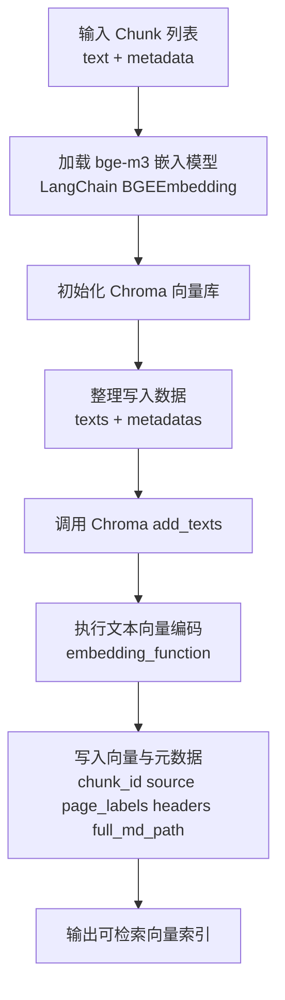

```mermaid
graph TD
    A[输入 Chunk 列表<br/>text + metadata] --> B[加载 bge-m3 嵌入模型<br/>LangChain BGEEmbedding]
    B --> C[初始化 Chroma 向量库]
    C --> D[整理写入数据<br/>texts + metadatas]
    D --> E[调用 Chroma add_texts]
    E --> F[执行文本向量编码<br/>embedding_function]
    F --> G[写入向量与元数据<br/>chunk_id source page_labels headers full_md_path]
    G --> H[输出可检索向量索引]
```
