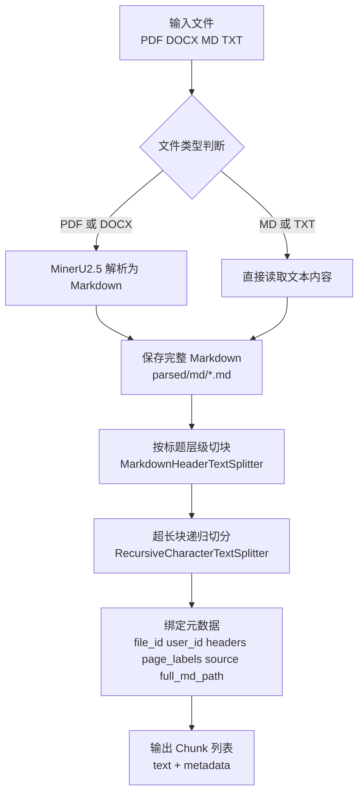

```mermaid
graph TD
    A[输入文件<br/>PDF DOCX MD TXT] --> B{文件类型判断}
    B -- PDF 或 DOCX --> C[MinerU2.5 解析为 Markdown]
    B -- MD 或 TXT --> D[直接读取文本内容]
    C --> E[保存完整 Markdown<br/>parsed/md/*.md]
    D --> E
    E --> F[按标题层级切块<br/>MarkdownHeaderTextSplitter]
    F --> G[超长块递归切分<br/>RecursiveCharacterTextSplitter]
    G --> H[绑定元数据<br/>file_id user_id headers page_labels source full_md_path]
    H --> I[输出 Chunk 列表<br/>text + metadata]
```
