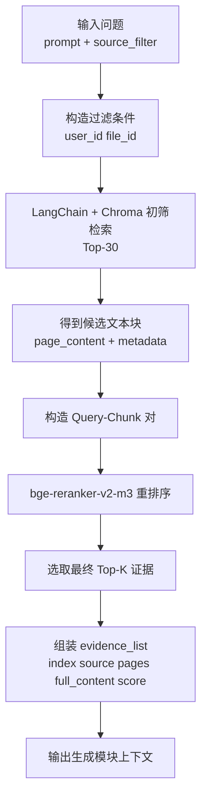

```mermaid
graph TD
    A[输入问题<br/>prompt + source_filter] --> B[构造过滤条件<br/>user_id file_id]
    B --> C[LangChain + Chroma 初筛检索<br/>Top-30]
    C --> D[得到候选文本块<br/>page_content + metadata]
    D --> E[构造 Query-Chunk 对]
    E --> F[bge-reranker-v2-m3 重排序]
    F --> G[选取最终 Top-K 证据]
    G --> H[组装 evidence_list<br/>index source pages full_content score]
    H --> I[输出生成模块上下文]
```
